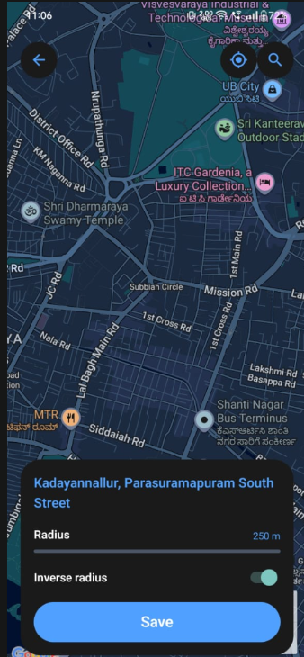

# December 28th, 2025

Before I dive into the deep end of how we’re securing CommitT, I have to mention the absolute disaster that started the day. As I was deep in the zone, piecing together the security logic, my laptop decided it had enough. A complete crash, followed by the kind of display glitch that makes your heart sink.

Luckily, once the hardware stabilized, the mental pieces I was putting together started to click. But before I could get too deep into security, there was another weight off my shoulders. For a while, we thought there was a fundamental fault with the maps. It just wouldn't load or behave, and it was becoming a real thorn in our side.

As it turns out, it wasn't a broken feature at all, but just a messy configuration issue that had been hiding in plain sight. It was Atheeq who finally sat down and untangled the mess. He got the map working perfectly, which was a huge relief. Now that he's cleared the path, I need to dive into the implementation, understand exactly how he solved it, and run some tests of my own to make sure it holds up under pressure.

I spent the rest of the day thinking out loud about one core question: *How do we stop people from cheating without turning the app into a digital prison?*

---

## The Security Deep Dive: How I Actually Thought About It

### What am I even trying to protect here?

That was the first thing I asked myself. Security depends entirely on what’s at stake. I’m not building a banking app. I’m not storing crores of money or protecting someone’s life savings.

I’m building an **accountability app**.

A user says: *“I’ll go to the gym between 6 and 7.”* And if they don’t… they lose ₹200. So the real problem isn’t “maximum security in the universe.” The real problem is: **How do I make sure the user doesn’t lie easily?** That’s the entire game.

### Okay, but can’t users just fake things?

This was my next worry. I imagined a user saying, “What if I just fake my location? What if I fake the time? What if I send fake data?”

Initially, I thought I’d just store time and location directly in a simple schema. But almost immediately, it felt wrong. Why? Because I realized I was designing my database around *features* instead of *logic*. Every new feature—app usage, photo proof, AI scores—would add new fields and make the backend a monster of custom validation.

### What is the common logic behind all conditions?

I paused and reframed the problem. No matter what the condition is, I’m always doing the same thing: I take a **value**, I compare it against a **range or rule**, and I decide pass or fail.

Whether it’s time, location, distance, or an AI confidence score, it’s always: *“Is X within Y?”*

That’s when the idea clicked. What if I separate *what* I check from *how* I check it? I redesigned everything into a model of **Metric**, **Relation**, and **Target**. Suddenly, the backend didn’t care what the metric was. It just evaluated: “Take the current value → apply relation → check target.” Features became data, not code. That’s when I felt the system could actually scale.

### Fine, schema is clean. But what about cheating?

Now came the paranoid phase. I started attacking my own app mentally. If I were a smart cheater, what would I do?

**Can someone intercept requests and change values?**
Yes, network attacks exist. But then I remembered certificate pinning and cryptographic request signing. Once those are in place, fake servers won’t work, and modified payloads won’t verify. Even if you intercept the request, you can’t change anything without breaking the signature. Network-level cheating collapses.

**What if they modify the APK itself?**
Sure, APKs can be decompiled. Someone could remove root checks or disable validations. But obfuscation makes this painful, and Play Integrity detects tampering. Realistically, 95% of users will never even attempt this.

**What about Frida, Xposed, or runtime hooking?**
This is where most apps die. Frida can hook into anything at runtime. So I stopped and asked: *How does Frida even talk to the app?* The answer is USB Debugging. No USB debugging means no ADB, no Frida attach, and no live inspection.

### The Big Mental Lock

I listed it carefully in my head. If USB debugging is OFF, then Frida is gone. Xposed injection is gone. The ADB shell is gone. Runtime patching is gone. 

What remains? Rooted phones, kernel-level exploits, hardware GPS spoofing... nation-state level attacks. Then I asked the most important question of all: **Who is going to do all this to save ₹200?**

And suddenly, everything became very clear. Security is not about being “unbreakable.” It’s about **making cheating irrational**. Spending days learning reverse engineering or buying ₹4000 GPS spoofing hardware just to skip the gym once? It makes no economic sense.

### The Strategy: Layers of Friction

It’s not one magic trick; it’s layers. Each layer alone is bypassable, but together, they push the user toward the easiest path: actually doing the task. We use request signing combined with certificate pinning. We add device integrity checks and clear economic penalties. We layer on psychological friction and social accountability.

At some point, the brain says, *“This is too much work. I’ll just go to the gym.”* And that’s exactly the outcome I want.

---

## The Final Realization

After all this thinking, the final truth became very simple: **If USB Debugging is OFF, none of this is possible.** 

No Frida. No runtime hooks. No ADB tricks. And our app can detect USB debugging, block usage when it’s enabled, and even prevent opening the USB debugging page alone. 

Once USB debugging is OFF, and requests are cryptographically signed: cheating becomes practically impossible for real users. Hacking becomes harder than the task itself. And the easiest option left is: **Just go do the commitment.**

That’s not accidental. That’s the entire design philosophy behind CommitT.
