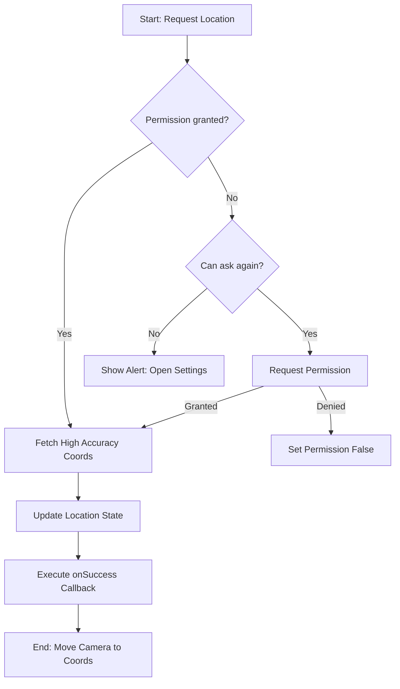
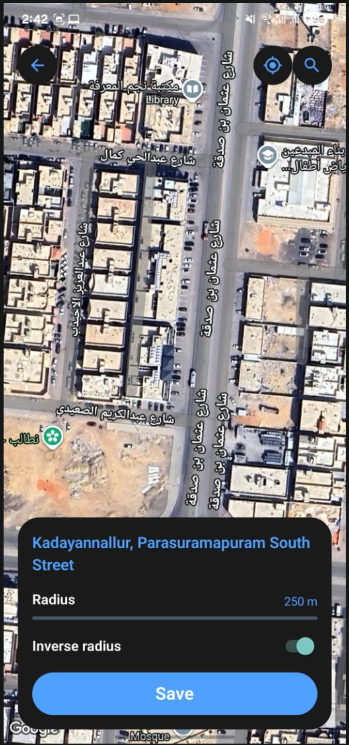
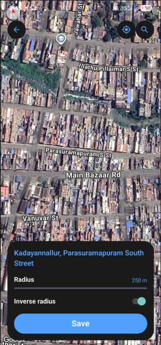

# December 29th, 2025

I was so happy that things were a bit fast today and smooth. It felt like everything was finally clicking into place.

## The Map Breakthrough

The highlight of today was definitely the maps. They finally started working! After some troubleshooting, we successfully managed to:

1.  **Fetch from Google Maps**: The maps are now correctly integrated and loading.
2.  **Enabled Satellite View**: We got the map ID and enabled the satellite imagery view, which looks great.
3.  **Stability**: We've finalized and stabilized the maps in general.

### Current State
For now, the plain maps just exist. We haven't added any specific features like markers, geofencing, or custom overlays yet. They are just there, fetched from Google Maps, and our next step will be to "tame" them for CommitT's specific use cases.

---

## Solving the Location Puzzle

Beyond the visuals, we cracked the core logic for location handling. We needed a robust way to handle permissions and fetching coordinates across different device states without cluttering our components.

### The `useLocation` Hook

We refactored the location logic into a reusable `useLocation` hook. This hook handles the three main cases: already granted, askable, and blocked (where we need to redirect the user to Settings).

```typescript
import { useState, useEffect } from "react";
import { Alert, Linking } from "react-native";
import * as Location from "expo-location";

export interface LocationCoords {
    latitude: number;
    longitude: number;
}

export function useLocation() {
    const [hasPermission, setHasPermission] = useState<boolean | null>(null);
    const [currentLocation, setCurrentLocation] = useState<LocationCoords | null>(null);
    const [isLocating, setIsLocating] = useState(false);

    // Initial check for permission on mount
    useEffect(() => {
        Location.getForegroundPermissionsAsync().then((status) => {
            if (status.granted) {
                setHasPermission(true);
            }
        });
    }, []);

    /**
     * The core logic to check, request, and fetch location.
     * Returns the coordinates if successful, or null otherwise.
     */
    const requestLocation = async (onSuccess?: (coords: LocationCoords) => void) => {
        if (isLocating) return null;
        setIsLocating(true);

        try {
            // 2. Check current location permission status
            const { status, canAskAgain } = await Location.getForegroundPermissionsAsync();

            let finalStatus = status;

            // 3. Branch based on permission state
            if (status !== "granted") {
                if (canAskAgain) {
                    // CASE — Permission NOT granted, but askable
                    const { status: newStatus } = await Location.requestForegroundPermissionsAsync();
                    finalStatus = newStatus;
                } else {
                    // CASE — Permission BLOCKED
                    setHasPermission(false);
                    Alert.alert(
                        "Location Access Disabled",
                        "Location access is disabled. Please enable it in Settings to use this feature.",
                        [
                            { text: "Cancel", style: "cancel" },
                            { text: "Open Settings", onPress: () => Linking.openSettings() },
                        ]
                    );
                    return null;
                }
            }

            if (finalStatus === "granted") {
                // CASE — Permission already GRANTED (or just granted)
                setHasPermission(true);
                
                // 4. Fetch current device location
                const location = await Location.getCurrentPositionAsync({
                    accuracy: Location.Accuracy.High,
                });

                const coords: LocationCoords = {
                    latitude: location.coords.latitude,
                    longitude: location.coords.longitude,
                };
                
                console.log("Fetched Coordinates:", coords);

                // 5. Update screen's location state
                setCurrentLocation(coords);
                
                // Allow the caller to run extra logic (like camera animation)
                onSuccess?.(coords);
                
                return coords;
            } else {
                setHasPermission(false);
                return null;
            }
        } catch (error) {
            console.error("Error fetching location:", error);
            Alert.alert("Error", "Could not fetch your current location. Please try again.");
            return null;
        } finally {
            setIsLocating(false);
        }
    };

    return {
        hasPermission,
        currentLocation,
        isLocating,
        requestLocation,
    };
}
```

### Permission & Fetch Flow

Here is how the logic flows when a user triggers a location request. It ensures we never leave a user in a "stuck" state if they've previously denied permissions.



### The "Locate Me" Feature

We also implemented the **Locate** button. The moment the user presses it, the app triggers the `requestLocation` flow. Once the coordinates are fetched, we use the `onSuccess` callback to smoothly animate the map camera to that position. This adds a critical layer of interactivity that makes the map feel alive and responsive.

---

## Proof of Work





<video controls src="./pow/29thvideo.mp4" width="100%"></video>
