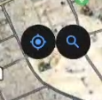
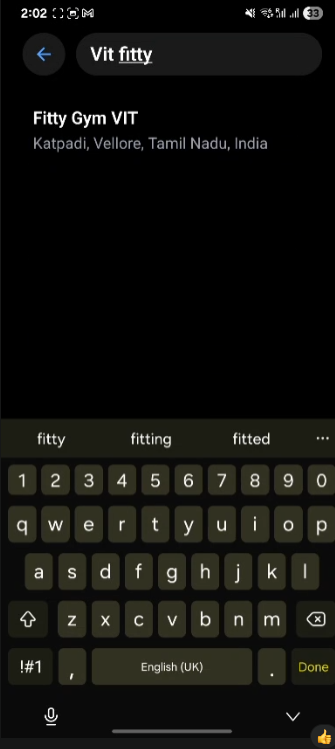
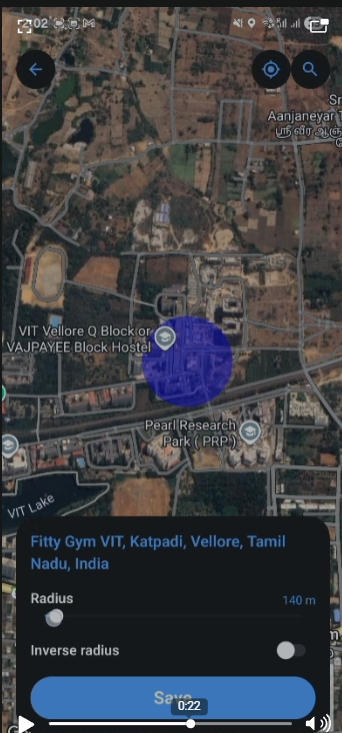
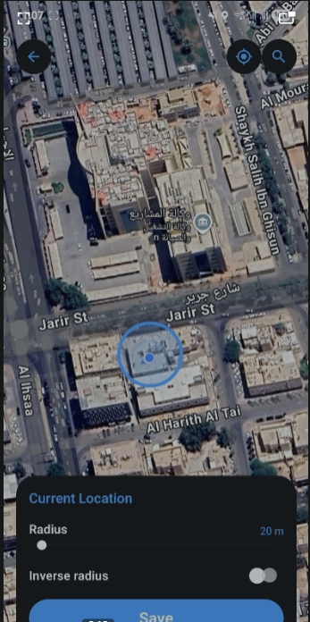
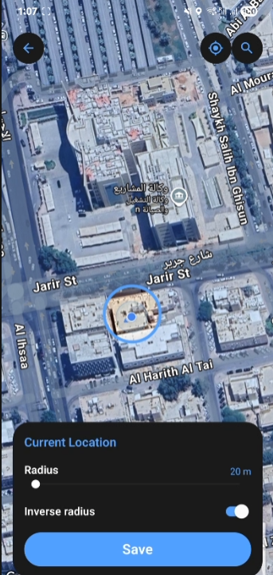

# December 30th, 2025

Today was about taking our basic map implementation and "taming" it for the real-world use cases of CommitT. We wanted to move from just "showing a map" to having a fully functional location discovery and geofencing engine.

## 1. Search & Discovery

We integrated the Google Places API to allow users to find specific locations without scanning the map manually.

*   **The Search Interface**: When a user taps the search icon, they are navigated to a dedicated search screen.
*   **Concepts Behind the Autocomplete**: We implemented a debounced search that fetches predictions from Google Maps. Once a place is selected, we fetch its detailed geometry (latitude and longitude) to update our global state.

---

## 2. State Management: Camera vs. Location

One of the trickiest parts was managing where the user is *looking* versus where the user is *committing*. We used **Zustand** to maintain two distinct states:

*   **Camera Target**: Where the map is focused. Clicking a search result card updates this target, smoothly sliding the map to the new area.
*   **Actual Location**: The specific point where the commitment circle/geofence is placed.

---

## 3. Interaction & Dynamic Feedback

The map now feels like a physical tool thanks to real-time interactions:

*   **Long Press for Placement**: Instead of just sticking a circle in the center, users can long-press anywhere on the map to set their commitment location instantly.
*   **Native Slider for Radius**: We replaced dummy controls with a real native slider. As the user slides, the radius updates in the central store, and the map's circle expands or shrinks in real-time.

---

## 4. The Inverse Geofence (The "Stay In" vs "Stay Out" Logic)

This is a core feature for discipline. Sometimes you need to stay *within* a area (like the Gym), but sometimes you need to stay *out* of an area (like a bar or a friend's house).

We implemented an "Inverse" toggle:
*   **Inward Fill**: A standard translucent blue circle indicating your allowed zone.
*   **Outward Fill (Inverse)**: We used a complex polygon calculation (wrapping the entire globe and cutting a circle out of it) to shade everything *outside* the target zone. This visually reinforces that the rest of the world is "off-limits" for the duration of the commitment.

  
  

---

## Proof of Work: Final Wrap-up

The video below demonstrates the full flow: searching for a place, navigating through results, placing a commitment via long-press, adjusting the radius, and toggling the inverse geofence.

<video controls src="./pow/30thFinalwork.mp4" width="100%"></video>
