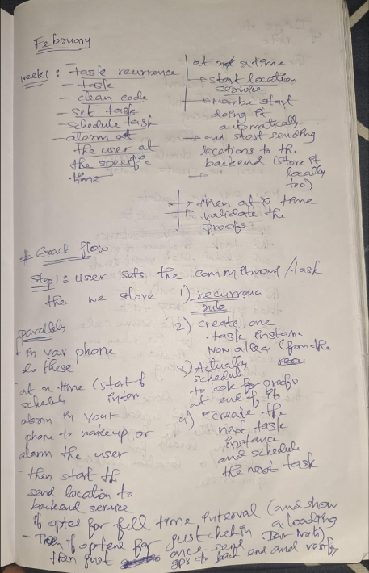
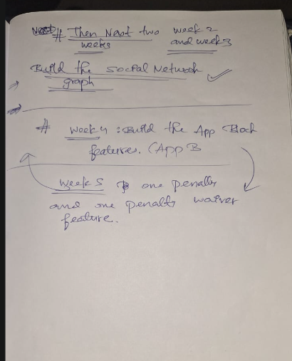

# February 3rd, 2026

**The Blueprint is Locked. Now We Build.**

After weeks of preparation, the full implementation roadmap is now clear. Here are the whiteboard notes that capture the plan:





---

## 🗓️ Week 1: Core Task & Scheduling Logic

This week is about the **backbone** of CommitT: creating tasks, storing recurrence rules, and making sure alarms survive device restarts.

### 1. Create Task Flow

| Step | Action | Details |
|------|--------|---------|
| 1 | User creates a Commitment/Task | Store: Title, Description, Conditions |
| 2 | Store Recurrence Rule | Daily/Weekly/Custom + interval + end condition |
| 3 | Create First Task Instance | Calculate next occurrence from recurrence rule |
| 4 | Schedule Local Alarm | Use Android AlarmManager to wake user at task start time (must persist across restarts!) |
| 5 | Schedule Proof Collection | At task end time, trigger validation logic |
| 6 | Start Location Service (if opted) | Begin sending GPS to backend OR just do a single check-in |

### 2. During Active Task Window

| Condition Type | What Happens |
|----------------|--------------|
| Full Time Interval | Continuously send location to backend + store locally |
| Check-in Only | Send GPS once at start, verify on backend, done |

### 3. Task Completion / End of Instance

| Step | Action |
|------|--------|
| 1 | Validate proofs (location, photo, etc.) |
| 2 | Mark instance as `verified` / `missed` / `waived` |
| 3 | Create next Task Instance (from recurrence rule) |
| 4 | Schedule the next alarm + proof collection |

### 4. Update Task Flow

| Step | Action |
|------|--------|
| 1 | Delete/Update current pending Task Instance |
| 2 | Update the Recurrence Rule in DB |
| 3 | Re-run instance creation logic (same as create flow) |
| 4 | Reschedule local alarms & location services |

### ⚠️ Critical: Alarm Persistence

> **Alarms must survive device restarts.**
> 
> Use `BOOT_COMPLETED` broadcast receiver + re-register alarms on boot.

This was already implemented in January (Day 14) with the `withBootReceiver` config plugin. We have the foundation; now we wire it to real tasks.

---

## 🗓️ Weeks 2 & 3: Social Network Graph

This is where CommitT becomes **"Social Stikk"**.

- Build the social/friend system (add, remove, accept invites)
- Allow assigning tasks to accountability partners
- Visibility controls (public / private / friends-only)
- Proof-of-work feed (friends see your check-ins, can react)

---

## 🗓️ Week 4: App Block Features (App B - Digital Commitment)

This is the **"make cheating irrational"** layer.

- Detect app launches (Accessibility Service)
- Block specified apps during task windows
- Show overlay / force return to home screen
- "Request Unlock" flow → all partners must approve

---

## 🗓️ Week 5: Penalty & Waiver

The **stakes** that make it real.

**Penalty Options (implement at least one):**
- Monetary (forfeit ₹X)
- Streak loss (reset counter)
- Embarrassing photo sent to partners

**Waiver Options (implement at least one):**
- Solve 100 CAPTCHAs
- Write a 3000-word reflection
- Complete a harder replacement task
- Grace period (1 free miss per month)

---

## Next Step

**Today:** Start implementing Week 1 - Create Task Flow.

This means:
1. Backend: Convex mutations for creating tasks with recurrence rules.
2. Frontend: Wire the existing UI to call those mutations.
3. Native: Ensure AlarmManager schedules the first instance.

Let's ship.

---

## 🚀 Today's Implementation: First Slice of Week 1

### The Challenge with AI-Assisted Development

The thing with working with AI is that at the moment, whatever you do seems good, but after a few months or days of work, the quality of work can seem really bad. To avoid this, we need to:

1. **Write production-level code** from day one
2. **Follow best practices** rigorously
3. **Plan before coding** - each slice should be crystal clear

---

### Today's Slice: Create Task with Recurrence Rule

**User Flow:**
```
User creates task in Zustand → User hits "Commit/Save" → Backend processes
```

**Three Possibilities on Commit:**
1. ✨ **First time commit** → Create recurrence rule → Create first task instance
2. 🔄 **Update existing** → Validate changes → Update rule & reschedule
3. ❌ **Delete** → Cancel all scheduled instances

---

### Validation Requirements (Before Any Create/Update)

| Validation | Description |
|------------|-------------|
| **At least 1 time slot** | Recurrence rule MUST have at least one time slot with one day |
| **No time/location overlap** | Same user cannot have overlapping tasks in the same time slot |

---

### Step-by-Step Production Implementation

#### Step 1: Backend - Validation Logic (`validators.ts`)

Create **pure functions** to validate:
- ✅ At least one time condition exists in the rule
- ✅ No overlapping tasks in the same time slot for this user
- ✅ Time slots are valid (start < end)

```typescript
// Pure function - easy to test, no side effects
function validateRecurrenceRule(rule: RecurrenceRule): ValidationResult {
  // Check at least one time condition
  // Check no internal overlaps
  // Return { valid: boolean, errors: string[] }
}

function checkForOverlaps(
  newRule: RecurrenceRule, 
  existingTasks: Task[]
): OverlapResult {
  // Compare time slots across days
  // Return { hasOverlap: boolean, conflictingTasks: Task[] }
}
```

#### Step 2: Backend - Recurrence Calculator (`recurrence.ts`)

Create **pure function** `getNextOccurrence()`:
- Takes: recurrence rule + base date
- Returns: next `{ start: Date, end: Date }`

```typescript
function getNextOccurrence(
  rule: RecurrenceRule, 
  afterDate: Date
): { start: Date, end: Date } | null {
  // Handle: once, daily, weekly, monthly, custom
  // Respect: days_of_week, interval, end conditions
  // Return null if recurrence has ended
}
```

#### Step 3: Backend - Modify `createTask` Mutation

Wire everything together in a single transaction:

```typescript
export const createTask = mutation({
  args: { /* task data + recurrence rule */ },
  handler: async (ctx, args) => {
    // 1. Run validations
    const validation = validateRecurrenceRule(args.recurrenceRule);
    if (!validation.valid) throw new Error(validation.errors.join(", "));
    
    // 2. Check for overlaps with existing tasks
    const existingTasks = await ctx.db.query("tasks")
      .filter(q => q.eq(q.field("userId"), args.userId))
      .collect();
    const overlaps = checkForOverlaps(args.recurrenceRule, existingTasks);
    if (overlaps.hasOverlap) throw new Error("Time slot conflict");
    
    // 3. Insert the task with recurrence rule
    const taskId = await ctx.db.insert("tasks", { ... });
    
    // 4. Calculate first instance times
    const firstOccurrence = getNextOccurrence(args.recurrenceRule, new Date());
    
    // 5. Insert first taskInstance
    const instanceId = await ctx.db.insert("taskInstances", {
      taskId,
      startTime: firstOccurrence.start,
      endTime: firstOccurrence.end,
      status: "pending"
    });
    
    // 6. Schedule Convex function at end time
    await ctx.scheduler.runAt(firstOccurrence.end, internal.tasks.onInstanceEnd, {
      instanceId
    });
    
    return { taskId, instanceId };
  }
});
```

#### Step 4: Backend - Scheduled Function (`onInstanceEnd`)

This runs automatically at each instance's end time:

```typescript
export const onInstanceEnd = internalMutation({
  args: { instanceId: v.id("taskInstances") },
  handler: async (ctx, { instanceId }) => {
    // 1. Get the instance and its parent task
    const instance = await ctx.db.get(instanceId);
    const task = await ctx.db.get(instance.taskId);
    
    // 2. Mark instance as ready for verification
    await ctx.db.patch(instanceId, { 
      status: "awaiting_verification" 
    });
    
    // 3. Calculate next occurrence
    const nextOccurrence = getNextOccurrence(
      task.recurrenceRule, 
      instance.endTime
    );
    
    // 4. If recurrence continues, create next instance
    if (nextOccurrence) {
      const nextInstanceId = await ctx.db.insert("taskInstances", {
        taskId: task._id,
        startTime: nextOccurrence.start,
        endTime: nextOccurrence.end,
        status: "pending"
      });
      
      // 5. Schedule next end-time trigger
      await ctx.scheduler.runAt(
        nextOccurrence.end, 
        internal.tasks.onInstanceEnd, 
        { instanceId: nextInstanceId }
      );
    }
  }
});
```

---

### Files to Create/Modify Today

| File | Purpose |
|------|---------|
| `convex/lib/recurrence.ts` | Pure functions for calculating next occurrence |
| `convex/lib/validators.ts` | Pure validation functions (overlap check, rule validation) |
| `convex/tasks.ts` | `createTask` mutation with full flow |
| `convex/internal/tasks.ts` | `onInstanceEnd` scheduled function |

---

### Quality Checklist

- [ ] All business logic in **pure functions** (testable, no side effects)
- [ ] Proper **TypeScript types** for all data structures
- [ ] **Error handling** with meaningful messages
- [ ] **No hardcoded values** - all config in constants
- [ ] **Atomic transactions** - if one step fails, nothing is committed
- [ ] **Idempotent operations** where possible
