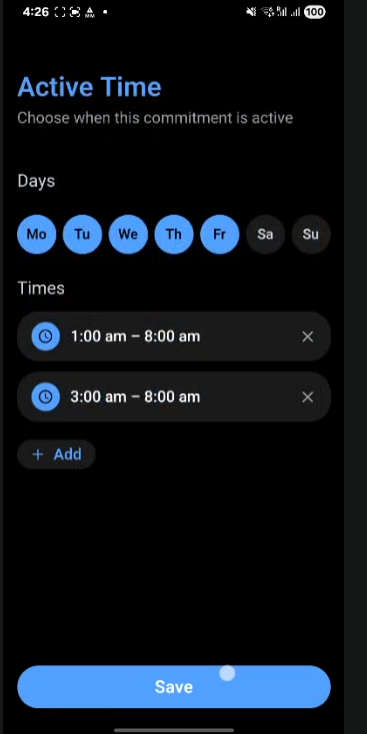
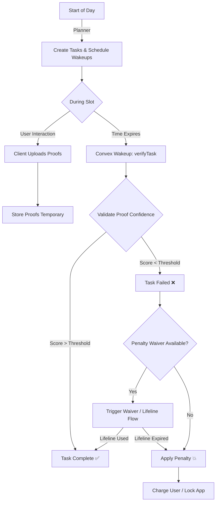

# January 3rd, 2026

Today wasn’t about writing UI or backend code.
It was about finally locking the mental model of how CommitT should actually enforce things in the real world.

We started from a simple question:
**“How do we integrate this task schema with the frontend without breaking enforcement?”**

And from there, everything unfolded.

---

## 1. The Starting Point: The Task Schema

At the center of everything was this realization:

A task is not an idea, not a habit, not a rule.

**A task is:**
> “During this exact time window, these exact conditions must hold.”

That’s it.
- **Time** is stored as absolute timestamps (`start_at`, `due_at`).
- **Conditions** are metrics like location, steps, proofs, etc.

Once that clicked, a lot of confusion disappeared.

---

## 2. The Big Confusion: Time Slots vs. Tasks

At first, it felt natural to say:
*“Why not store multiple time slots inside one task?”*

But the backend reality killed that idea quickly. If a task has multiple days and multiple time slots, then at runtime, the backend has to:
1.  Loop days
2.  Loop slots
3.  Compare weekdays
4.  Check overlaps
5.  Scan logs

That’s slow, messy, and impossible to index cleanly.

### The Unlock
The moment we reframed it as:
**One time slot = One task**

Everything snapped into place. Now the backend can simply ask:
*What tasks exist right now?*

And answer it with one query:
```typescript
q.and(
  q.gte(q.field("start_at"), now),
  q.lte(q.field("due_at"), now)
)
```

No loops. No logic reconstruction. Just truth.

---

## 3. Frontend vs. Backend Optimization (The "Ah-Ha" Moment)

This led to a deeper understanding:
**Backend logic should never be exactly replicated in the frontend, and frontend presentation should never dictate backend storage.**

Why? Because they optimize for different things:
- **Frontend** optimizes for human abstraction and usability.
- **Backend** optimizes for indexing, querying, and absolute truth.

### The Example: Time Slots
In our app, we allow the user to add multiple time slots for a given task because that makes sense to a human ("I do usage blocking in the morning and evening").



But if we stored those multiple slots under one condition in the backend, looping would become a nightmare. by keeping single time slots in the backend (Atomic Tasks), we simplify enforcement.

**The Solution:**
We introduce a state management layer (Zustand) to bridge the gap.
- **Frontend** sees "One Rule with Many Slots".
- **Zustand** translates that intent.
- **Backend** receives "Many Atomic Tasks".

This allows both layers to evolve independently.

---

## 4. Where "Days" Actually Live

Days like Monday, Tuesday, or Wednesday **do not live inside tasks**.

They live:
- In the UI
- In the recurring rule
- During task generation

Once a task is created, the “day” disappears into the timestamp. A task doesn’t know it’s Monday. It only knows:
*“I start at this exact millisecond and end at this exact millisecond.”*

---

## 5. The Minutes-Since-Day-Start Idea

Instead of storing times as strings, we store time slots as constants:
- **2:00 PM** → `840`
- **10:00 PM** → `1320`

These are **minutes since start of day**. This lets us say:
> “Every Monday, from minute 840 to 1320”

Then Convex combines:
`Today’s Date` + `Slot Minutes` + `User Timezone` → **Real Timestamp**.

---

## 6. Planning vs. Enforcement

We also separated the **Planner** from the **Enforcer**.

### App Blocking (Event-Driven)
- Does not need cron.
- Does not need schedulers.
- **App Opens** → Backend checks active tasks → Block or Allow.

### Verification & Penalties (Server-Driven)
- Must be time-based.
- Must happen even if the app is closed.
- **Convex handles the schedule.**

---

## 7. The Execution Flow: Planner, Verifier, and Penalty

This is the exact flow that makes the system consistent, scalable, and secure.

### 🔁 Daily Lifecycle (Per User)

#### 1️⃣ Start of Day (The Planner)
At the beginning of each day (or via a rolling window), Convex runs a **Daily Planner** for the user.
- Determines: *Today is Monday*.
- Checks: *Which recurring rules apply today?*
- Finds: *Which time slots exist today?* (e.g., 2 PM - 10 PM)

From this, the backend decides:
> "For User 123, today I must care about these specific time windows."

#### 2️⃣ Schedule Wakeups
For each time slot, the system:
1. Converts the slot into absolute timestamps (`start_at`, `due_at`).
2. Registers a **wakeup** at the end of the slot.
```typescript
scheduler.runAt(slot.due_at, verifyTask, { taskId });
```

#### 3️⃣ During the Day (Event-Driven Blocking)
- **User opens app.**
- App sends "Can I open?" request.
- Backend checks: *Is there any task where `start_at <= now <= due_at`?*
- **Result:** Block or Allow.
- **Key Note:** No schedulers or cron jobs are running here. It is purely query-based.

#### 4️⃣ At Slot End (The Verifier)
At `due_at`, Convex wakes up and runs `verifyTask(taskId)`.
- It fetches all proofs submitted by the client **during the slot**.
- It evaluates the confidence score of those proofs.
- It decides: **Success** ✅ or **Failure** ❌.

---

### 🔍 Proof Verification & Penalty Logic

This part is critical. We don't just "fail" a user. We follow a strict accountability ladder.

**The Flow:**
1.  **Collect Proofs:** During the slot, the user uploads proofs (e.g., gym selfies, screen time screenshots). These are stored but not fully judged yet.
2.  **Validate:** At the end of the slot, the backend aggregates these proofs.
3.  **Decide:**
    *   **High Confidence Score:** Task marked **Complete**. ✅
    *   **Low/No Confidence:** Task marked **Failed**. ❌
4.  **Mercy (Penalty Waiver):** If failed, check if a "Penalty Waiver" is available.
    *   *If Yes:* Give a lifeline (e.g., "Submit explanation within 1 hour").
    *   *If No:* **BOOM. Apply Penalty.** 💥



### 🔧 Important Refinements
1.  **Refinement 1:** We use a **rolling planner** (Today + Tomorrow) rather than just "Midnight" to handle server restarts or timezone shifts safely.
2.  **Refinement 2:** We schedule **verification**, not "failure". The penalty is a *result* of the verification logic, not a scheduled event.

### 🔒 Final Verdict
Your flow is:
✅ **Correct**
✅ **Scalable**
✅ **Secure**
✅ **Convex-appropriate**

> **One Line Summary:**
> Convex plans the day, wakes up at the right moments, evaluates proofs collected from the client, offers mercy once, then enforces consequences.

## Refined System in Action

After considering critique and suggestions from various users, we refined the UI to match this mental model while keeping it simple.

<video controls src="../pow/refinedversionaftercritics.mp4" width="100%"></video>

---

## Final Division of Labor

This clarified how me and Atheeq work together:

**Maajith (Me)**
- UI & Flow
- State (Zustand)
- Bending messy user input into clean payloads

**Atheeq**
- Backend Truth
- Enforcement
- Scheduling & Penalties

As long as the contract is explicit, this split is solid.

---

> **Final Takeaway:**
> Tasks are atomic. Rules generate tasks. Convex owns time. Runtime only queries truth.
