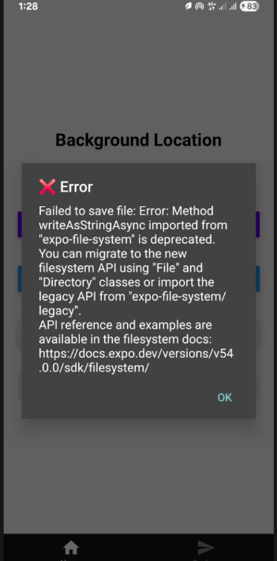
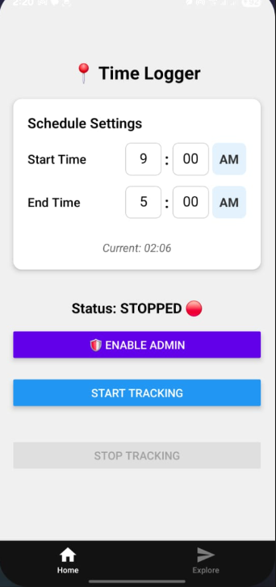

# 🚨 VibeCoded Alert 🚨

> **Disclaimer:** Most of the engineering below was done with a **Vague Understanding** ("Vibe Coding"). We successfully infiltrated the OS and managed memory threads, but we are honest about the fact that we still have a lot to learn. We are using this session not as a display of mastery, but as a **Base** to learn these deep concepts in the future.

## The Session: A Crash Course via Vibe

This effectively became a crash course in **Advanced Android Architecture** within React Native. We touched the operating system's kernel, managed memory across separate threads, and fought the Gradle build system—often figuring it out on the fly.

We didn't just write code; we vibe-architected a system that survives the user.

## 1. The Operating System Layer: Breaking the Sandbox

**The Problem:**
Standard Android apps are "sandboxed." If a user swipes the app away, the OS (Linux kernel) kills the process.
*   *Vibe Check:* We knew we needed to survive this, but understood purely through "feeling" that permissions weren't enough.

**The Solution:** `DeviceAdminReceiver`.

**The Deep Dive:**
We registered a `DeviceAdminReceiver` in the `AndroidManifest.xml`.
*   **The Manifest Contract:** By adding the `<receiver>` tag, we told the Android OS: *"Even if this app is closed, I need you to listen for specific system events on my behalf."*
*   **The Policy File:** We specifically requested `force-lock`.
*   **The Learning Base:** We now know this elevates app priority against the "Low Memory Killer" (LMK). We still need to study the *exact* lifecycle of these receivers to master them.

## 2. The Bridge Layer: Crossing the Divide

**The Problem:**
React Native is JavaScript. Android is Kotlin. They don't speak the same language. JS cannot say "Make me an Admin."

**The Solution:** Native Modules (`SchedulerModule.kt`).

**The Deep Dive:**
We wrote a custom Java Class that extends `ReactContextBaseJavaModule`.
1.  **Serialization:** JS clicks serialized into JSON-like messages.
2.  **The Runtime:** The `SchedulerModule` received this message.
3.  **Context Hell (The Vague Part):** We hit errors like `Unresolved reference 'currentActivity'`. We solved it, but the distinction between `Activity` (UI) and `Service` (Background) contexts is something we need to research deeper. We know *that* it matters, but we are still learning *why* in every edge case.

## 3. The "Split Brain" Problem: Headless JS

**The Problem:**
UI Thread (React) and Background Thread (Location Task) **do not share memory**.
*   *Vibe Check:* We instinctively knew we couldn't pass variables, but didn't initially know how to bridge the gap.

**The Solution:** File System Persistence (`settings.json`).

**The Deep Dive:**
*   **The Struggle:** We tried MMKV (C++ memory mapping) but failed due to Expo architecture issues we didn't fully grasp.
*   **The Fix:** We fell back to `expo-file-system`. Writing to disk created a **Shared Singularity**.
*   **The Metric:** UI calculates minutes -> Writes to Disk -> Background reads Disk.

## 4. The Logic Layer: Minute-Linearization

**The Problem:**
Parsing time strings ("5:30 PM") is brittle.

**The Solution:** Minute-Linearization (O(1) Math).

**The Deep Dive:**
We converted everything to **Minutes from Midnight (0-1440)**.
*   **The Insight:** This robust integer logic is how OS schedulers work. We stumbled onto this pattern and realized its power: `if (currentNow >= start && currentNow < end)`.

## 5. The Engineering Process: The Tactical Revert

**The Event:**
We tried to implement `AlarmManager`. The build failed repeatedly.

**The Vibe Decision:**
Instead of digging a hole with code we didn't understand, we **Reverted**.
*   We cleaned the Manifest.
*   We deleted the broken Kotlin code.

**The Lesson:**
> "Working code with fewer features is infinitely better than broken code with many features."

## Summary for "CommitT"
We established a **Base** for the future:
1.  **Native Modules** are non-negotiable for system enforcement.
2.  **File Persistence** is required for the "Split Brain" architecture.
3.  **Resilience** against the build system is part of the job.

We may have "vibe coded" our way here, but the architectural pillars we found are real. Now we must study them in depth.
