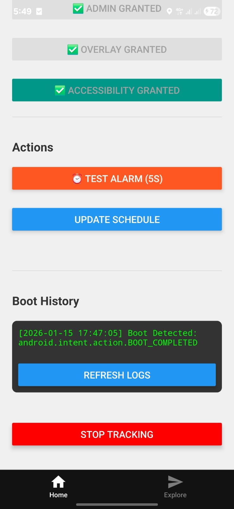

## Project: The "Unkillable" Accountability App

**Core Philosophy:**
A React Native app is just a UI. To control the phone (block apps, prevent uninstall, auto-start), we needed to break out of the JavaScript sandbox and write **Native Kotlin Code**.
We achieved this using **Expo Config Plugins**, which allows us to inject this native code automatically during the build process, keeping our source clean and upgradeable.

## 🛠️ The Architecture: "The 5 Pillars"

We built five distinct native systems, each isolated in its own plugin directory.

### 1. The Bridge (`withHelloModule`)
**Purpose:** The communication line between React Native (JS) and Android (Kotlin).

*   **`HelloModule.kt`:** A native module that exposes methods to JS.
*   **Permission Manager:** We expanded this module to be our central "Permission Center". It contains the logic to:
    *   Check/Request **Device Admin**.
    *   Check/Request **Overlay Permissions**.
    *   Check/Request **Accessibility Services**.
*   **Smart Intents:** Instead of crashing or showing a generic error, we wrote logic to deep-link into specific settings pages (like `DeviceAdminSettingsActivity`) so the user finds the toggle instantly.

### 2. The Shield: Device Admin (`withDeviceAdmin`)
**Purpose:** To prevent the user from easily uninstalling the app or force-stopping it.

*   **`MyDeviceAdminReceiver.kt`:** A special `BroadcastReceiver` that listens for admin events.
*   **`device_admin_policies.xml`:** Defined policies (like `force-lock`) which tells Android "This is a security app".
*   **Manifest Injection:** The plugin automatically adds the `<receiver>` tag with `BIND_DEVICE_ADMIN` permission to `AndroidManifest.xml`.

### 3. The Clock: Reliable Alarms (`withAlarmModule`)
**Purpose:** Standard JS `setTimeout` dies when the app is backgrounded. We needed alarms that ring even if the phone is asleep (Doze Mode).

*   **Technology:** Used `setExactAndAllowWhileIdle`. This is the "Nuclear Option" for alarms—it forces the phone to wake up even if it's in deep battery saving mode.
*   **`AlarmReceiver.kt`:** Catches the alarm signal to show a Toast (future: play sound/block screen).

### 4. The Eyes & The Sword: Accessibility & Overlays (`withAccessibilityService`)
**Purpose:** To "See" what the user is doing and "Block" them if they misbehave.

*   **`MyAccessibilityService.kt`:** The most powerful part of the app.
*   **Event Listening:** Listens for `TYPE_WINDOW_STATE_CHANGED` events (apps switching).
*   **The Sword (Blocking Logic):**
    *   If `event.packageName` equals `com.instagram.android` or `com.zhiliaoapp.musically` (TikTok):
    *   **Action:** Executes `performGlobalAction(GLOBAL_ACTION_HOME)` to instantly kill the app.
    *   **Visual:** Draws a black "BLOCKED" overlay using WindowManager.

### 5. Immortality: Boot Receiver (`withBootReceiver`)
**Purpose:** If the user restarts their phone to kill the app, the app must rise again.

*   **`BootReceiver.kt`:** Listens for `BOOT_COMPLETED` signal.
*   **Direct Boot:** Enabled `directBootAware="true"`, allowing code to run before the user even types their PIN (Android 7+ feature).
*   **Proof:** We implemented a file logger that writes a timestamp to `boot_history.txt` immediately upon boot. JS reads this to prove the wake-up.

---

## ⚠️ Challenges & Solutions

We faced specific hurdles typical of advanced Android development:

1.  **Configuring `MainApplication.kt`**:
    *   *Problem:* New packages need manual linking.
    *   *Solution:* We wrote a regex-based plugin helper to parse the Kotlin string and inject `add(MyPackage())` dynamically.
2.  **Android 12 Security**:
    *   *Problem:* Crashes if `android:exported` isn't declared.
    *   *Solution:* Ensured every Receiver/Service in our templates had `android:exported="true"` explicitly.
3.  **Finding Settings Pages**:
    *   *Problem:* Device Admin settings are buried.
    *   *Solution:* Robust try/catch blocks that fall back to general Security Settings if specific intents fail.

---

## 🏆 Proof of Work

We achieved a modular, native accountability base capable of blocking apps, preventing deletion, and surviving restarts.

<video controls className="w-full aspect-video" src="../pow/14thjan.mp4"></video>

**Learnings on Bootloaders:**
We also went deep into understanding the Android Bootloader process to ensure our Boot Receiver hooks in as early as theoretically possible.

