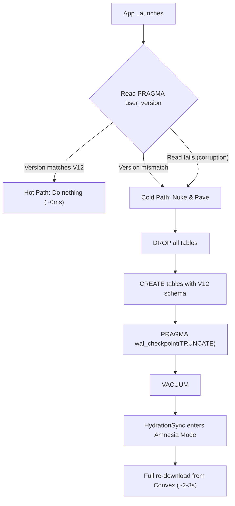

# Local Database

CommitT uses **Expo SQLite** as a local cache layer on the device. The database file (`commit.db`) mirrors a subset of the Convex cloud data for offline access and high-speed reads by the native Kotlin enforcement layer.

<Warning>
The local database is a **disposable cache**, not a source of truth. Convex is the canonical data store. If the local database is ever corrupted, it is destroyed and rebuilt from scratch.
</Warning>

## Schema Version: V12 (Instance-Dependent)

The current schema version is **V12**, which introduced the "Instance-Dependent Architecture" — a fundamental design shift that eliminated an entire class of database corruption bugs.

### The Problem (V1–V11)

Earlier versions used `FOREIGN KEY` constraints between `task_instances` and `local_tasks`. This required toggling `PRAGMA foreign_keys` on and off during writes, which:

1. **Cannot be changed inside a transaction** — SQLite silently ignores the PRAGMA
2. **Creates race conditions** when concurrent writers share a connection
3. Was the **root cause** of `database disk image is malformed` errors

### The Solution (V12)

V12 removes ALL foreign key constraints. Orphaned instances (instances whose parent task has been deleted) are treated as **first-class citizens**:

```sql
-- task_instances: Orphan-safe — no FK to local_tasks.
CREATE TABLE task_instances (
    id TEXT PRIMARY KEY,
    task_id TEXT NOT NULL,        -- No REFERENCES clause
    convex_id TEXT NOT NULL,
    title TEXT DEFAULT '',
    scheduled_timestamp INTEGER NOT NULL,
    start_time INTEGER NOT NULL,
    end_time INTEGER NOT NULL,
    status TEXT DEFAULT 'pending',
    config_json TEXT NOT NULL DEFAULT '{}',
    checkpoints TEXT NOT NULL DEFAULT '[]',
    penalty_json TEXT DEFAULT NULL,
    conditions_json TEXT DEFAULT NULL,
    penalty_waiver_json TEXT DEFAULT NULL,
    is_manual_edit INTEGER DEFAULT 0,
    strict_until INTEGER DEFAULT NULL,
    created_at INTEGER NOT NULL
);
```

<Info>
**Why orphaned instances matter:** The Convex backend intentionally preserves manually-edited and strict-locked task instances even after their parent task is deleted. This prevents users from escaping penalties by deleting a task after failing it.
</Info>

## Migration Strategy: Nuke & Pave

There are **no incremental migrations**. The strategy is binary:



This eliminates the **"Frankenstein Schema" problem** — where partially-applied incremental migrations leave the database in an inconsistent state.

## Tables

### `local_tasks`
Mirror of the Convex `tasks` collection. Contains the master commitment definitions including recurrence rules, penalty contracts, and strict-mode configuration.

| Column | Type | Description |
|---|---|---|
| `id` | TEXT (PK) | Convex document ID |
| `title` | TEXT | Commitment title |
| `recurrence_json` | TEXT | JSON-serialized recurrence rules |
| `penalty_json` | TEXT | JSON-serialized penalty contract |
| `penalty_waiver_json` | TEXT | JSON-serialized waiver challenge rules |
| `strict_until` | INTEGER | Epoch ms — mutations blocked until this time |
| `updated_at` | INTEGER | Used by Freshness Guards |

### `task_instances`
Individual occurrences of commitments. These are the records actively read by the native Kotlin Accessibility Service for enforcement decisions.

| Column | Type | Description |
|---|---|---|
| `id` | TEXT (PK) | Convex document ID |
| `task_id` | TEXT | Parent task reference (no FK constraint) |
| `start_time` | INTEGER | Epoch ms — commitment window opens |
| `end_time` | INTEGER | Epoch ms — commitment window closes |
| `status` | TEXT | `pending`, `proceeding`, `completed`, `failed` |
| `config_json` | TEXT | Verification style, alarm settings |
| `is_manual_edit` | INTEGER | `1` if user manually edited (Freshness Guard protected) |

## WAL Journaling

The database operates in **WAL (Write-Ahead Logging) mode** for concurrent read/write performance:

```sql
PRAGMA journal_mode = 'wal';
```

<Warning>
The native Kotlin Accessibility Service opens a **READONLY** connection to `commit.db`. This is critical — if the service opened a read-write connection, it would compete for the WAL writer lock with the JavaScript thread, causing immediate corruption on eMMC storage devices.
</Warning>

## Surgical Purge vs Nuclear Option

| Operation | What it does | When to use |
|---|---|---|
| **Surgical Purge** | `DELETE FROM` all tables, keep schema intact | Manual Resync, Amnesia Recovery |
| **Nuclear Option** | `DROP` + `CREATE` + `VACUUM` | Terminal corruption, schema version mismatch |

The Surgical Purge preserves file descriptor integrity — native Android services keep their database handles alive, preventing POSIX Error 9 (Bad File Descriptor).
