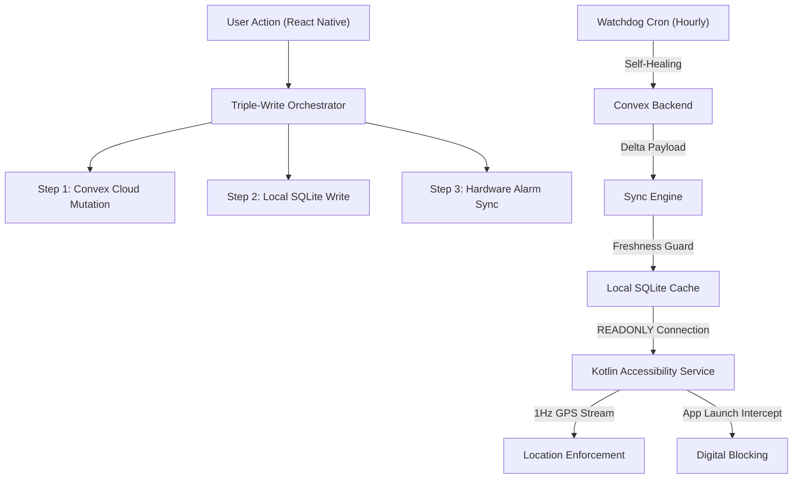

# Architecture Overview

CommitT is a **Turborepo monorepo** with a strict separation between client applications, shared packages, and native platform code. Every component is designed around a single principle: **the user cannot bypass their own commitments**.

## Monorepo Structure

```
mono/
├── apps/
│   ├── native/          # React Native + Expo (Android/iOS)
│   ├── web/             # Tauri + Vite + React (Desktop)
│   └── extension/       # WXT Browser Extension
├── packages/
│   ├── backend/         # Convex serverless functions
│   ├── config/          # Shared TypeScript configs
│   ├── env/             # Environment variable validation
│   └── monitoring-*/    # Telemetry packages
├── turbo.json
└── package.json
```

## Data Flow Architecture



## The Provider Tree

The app's root `_layout.tsx` establishes a deeply layered provider architecture. The order is critical — each layer depends on the one above it:

```
ResurrectionProvider          ← System reset capability
  └─ SQLiteProvider           ← Local database (commit.db)
      └─ ConvexClientWrapper  ← Real-time cloud connection
          └─ SecurityShield   ← Root/jailbreak detection gate
              └─ GestureHandler
                  └─ KeyboardProvider
                      └─ AppThemeProvider
                          └─ HeroUINativeProvider
                              └─ ThemeProvider
                                  ├─ HydrationEngine  ← Background sync
                                  ├─ StackLayout       ← Navigation
                                  └─ HealOverlay       ← Recovery UI
```

<Warning>
The **SecurityShield** sits above the navigation stack. If a rooted device or jailbreak is detected (via JailMonkey), the entire app tree below it is unmounted and replaced with a violation screen. There is no way to navigate around it.
</Warning>

## Key Design Principles

### 1. Convex is the Source of Truth
The local SQLite database is a **disposable cache**. If it becomes corrupted or out of date, the system performs a "Nuke & Pave" — dropping all tables and rebuilding the schema from scratch. Data is then re-downloaded from Convex via the HydrationSync engine ("Amnesia Mode").

### 2. Fail-Closed Security
If GPS data is stale, the database is unreadable, or the sync token is missing, the Accessibility Service **blocks by default**. The system never fails open — ambiguity is treated as a violation.

### 3. Instance-Dependent Architecture
Task instances (individual occurrences of a commitment) are first-class citizens. They can survive even after their parent task is deleted. This prevents users from escaping penalties by deleting a task after failing it.

### 4. Immutable Penalty Snapshots
When a task instance is created, the penalty and waiver rules are **frozen** onto the instance. Even if the user later edits the parent task's penalty settings, the existing instance enforces the original contract.
