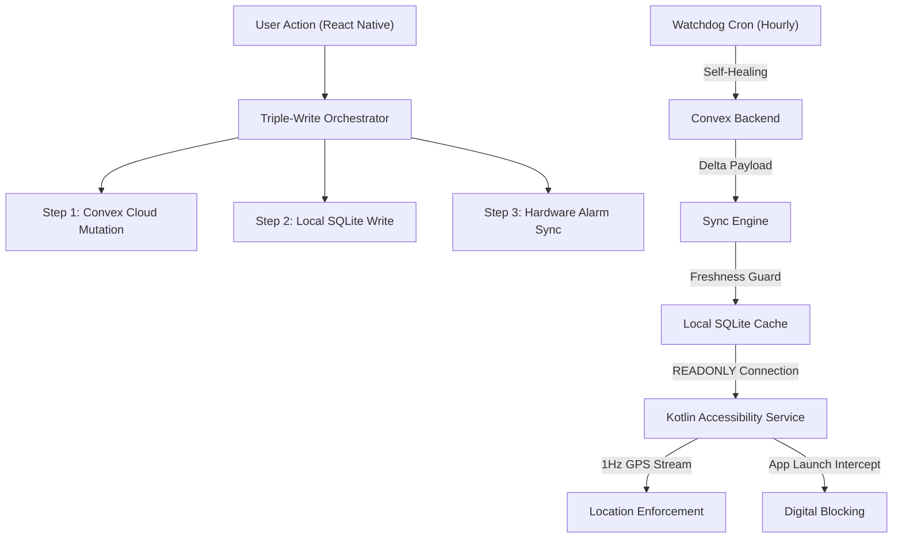

# Architecture Overview

CommitT is a **Turborepo monorepo** with a strict separation between client applications, shared packages, and native platform code. Every component is designed around a single principle: **the user cannot bypass their own commitments**.

---

## Monorepo Structure

```
mono/
├── apps/
│   ├── native/          # React Native + Expo (Android/iOS)
│   ├── web/             # Tauri + Vite + React (Desktop)
│   └── extension/       # WXT Browser Extension
├── packages/
│   ├── backend/         # Convex serverless functions
│   ├── config/          # Shared TypeScript configs
│   ├── env/             # Environment variable validation (Zod + @t3-oss/env-core)
│   └── monitoring-*/    # Telemetry packages
├── turbo.json
└── package.json         # Bun workspace root
```

<CardGroup cols={2}>
  <Card title="apps/native" icon="mobile">
    The primary application. React Native + Expo with 7 custom Kotlin native modules, Zustand state management, and a full Expo Router navigation stack.
  </Card>
  <Card title="packages/backend" icon="server">
    Convex serverless backend with Domain-Driven Design. Contains API, Core, Execution, and DB layers with a 500+ line typed schema.
  </Card>
  <Card title="apps/web" icon="desktop">
    Tauri desktop dashboard for monitoring commitments from a computer. Shares the Convex backend with the mobile app.
  </Card>
  <Card title="apps/extension" icon="puzzle-piece">
    WXT-based browser extension for blocking distracting websites. Syncs blocklist rules from the same Convex backend.
  </Card>
</CardGroup>

---

## Data Flow Architecture

The entire system revolves around three isolated data environments that must stay synchronized:



Every user action that modifies data must write to **three independent systems** in sequence:

| Step | Target | Failure Behavior |
| :--- | :--- | :--- |
| **1. Convex Cloud** | Persist to the source of truth | Entire operation halts cleanly |
| **2. Local SQLite** | Update the on-device cache for instant UI | Rolls back Step 1 via compensating mutation |
| **3. Hardware Alarms** | Re-sync Android AlarmManager | Task exists but alarms may not fire |

---

## The Provider Tree

The app's root `_layout.tsx` establishes a deeply layered provider architecture. The order is critical — each layer depends on the one above it:

```typescript
// apps/native/app/_layout.tsx — Simplified provider nesting
export default function Layout() {
  return (
    <ResurrectionProvider>              {/* System reset capability */}
      <SQLiteProvider                    {/* Local database (commit.db) */}
        databaseName="commit.db"
        onInit={migrateDbIfNeeded}
      >
        <ConvexClientWrapper>            {/* Real-time cloud connection */}
          <SecurityShield>               {/* Root/jailbreak detection gate */}
            <GestureHandlerRootView>
              <KeyboardProvider>
                <AppThemeProvider>
                  <HeroUINativeProvider>
                    <ThemeProvider>
                      <HydrationEngine /> {/* Background sync (invisible) */}
                      <StackLayout />     {/* Navigation */}
                      <HealOverlay />     {/* Recovery UI */}
                    </ThemeProvider>
                  </HeroUINativeProvider>
                </AppThemeProvider>
              </KeyboardProvider>
            </GestureHandlerRootView>
          </SecurityShield>
        </ConvexClientWrapper>
      </SQLiteProvider>
    </ResurrectionProvider>
  );
}
```

<Warning>
The **SecurityShield** sits above the navigation stack. If a rooted device or jailbreak is detected (via JailMonkey), the entire app tree below it is unmounted and replaced with a violation screen. There is no way to navigate around it.
</Warning>

---

## Resurrection Protocol

The `ResurrectionProvider` wraps the entire tree and exposes an `iteration` counter. When a catastrophic failure is detected (database corruption, WebSocket death, unrecoverable state), the system increments the counter. This causes `ConvexClientWrapper` to destroy the old Convex client and spawn a fresh one:

```typescript
// ConvexClientWrapper re-creates the client on every iteration change
const convexClient = useMemo(() => {
  return new ConvexReactClient(convexUrl, { unsavedChangesWarning: false });
}, [iteration]); // <-- iteration from ResurrectionProvider
```

A `useRef` stores the previous client and explicitly calls `.close()` on it before the new client takes over. This prevents orphaned WebSocket connections from corrupting the WAL journal — a bug discovered on Lenovo K12 Note devices with slow eMMC storage.

---

## Key Design Principles

<AccordionGroup>
  <Accordion title="Convex is the Source of Truth" icon="cloud">
    The local SQLite database is a **disposable cache**. If it becomes corrupted or out of date, the system performs a "Nuke and Pave" — dropping all tables and rebuilding the schema from scratch. Data is then re-downloaded from Convex via the HydrationSync engine ("Amnesia Mode").
  </Accordion>
  <Accordion title="Fail-Closed Security" icon="shield">
    If GPS data is stale, the database is unreadable, or the sync token is missing, the Accessibility Service **blocks by default**. The system never fails open — ambiguity is treated as a violation.
  </Accordion>
  <Accordion title="Instance-Dependent Architecture" icon="cubes">
    Task instances (individual occurrences of a commitment) are first-class citizens. They survive even after their parent task is deleted. This prevents users from escaping penalties by deleting a task after failing it. The SQLite schema has **zero foreign key constraints** by design.
  </Accordion>
  <Accordion title="Immutable Penalty Snapshots" icon="lock">
    When a task instance is created, the penalty and waiver rules are **frozen** onto the instance. Even if the user later edits the parent task's penalty settings, the existing instance enforces the original contract. This prevents retroactive manipulation (e.g., setting a large penalty, failing, then quickly editing it to a minimal one).
  </Accordion>
</AccordionGroup>
