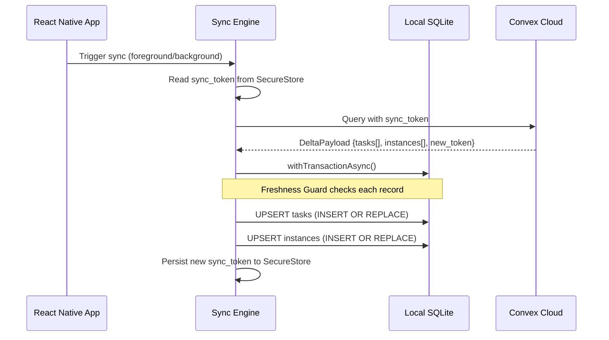

# Sync Engine

The Sync Engine is the core data pipeline that keeps the local SQLite database in sync with the Convex cloud backend. It uses a **delta-based** approach — only downloading records that have changed since the last successful sync.

## How It Works



## The Delta Payload

Every sync cycle transmits a `DeltaPayload` containing only the records modified since the last sync token:

```typescript
interface DeltaPayload {
  tasks: any[];       // Modified task records
  instances: any[];   // Modified instance records  
  sync_token: number; // Epoch timestamp for next delta
}
```

## Freshness Guards

The Sync Engine implements a two-tier **Freshness Guard** system to prevent stale Convex data from overwriting newer local edits.

### Task-Level Guard

Before upserting a task, the engine compares the incoming `updated_at` timestamp against the local record:

```typescript
const existing = await db.getFirstAsync<{ updated_at: number }>(
  `SELECT updated_at FROM local_tasks WHERE id = ?`, [task._id]
);

if (existing && existing.updated_at > incomingTime) {
  // DISCARD: Local data is newer than the cloud payload
  skippedTaskIds.add(task._id);
  continue;
}
```

### Instance-Level Guard

Instances have an additional protection layer: if a local instance has been **manually edited** (flagged via `is_manual_edit`), incoming cloud data that doesn't have this flag is discarded:

```typescript
if (existingInstance?.is_manual_edit === 1 && !instance.is_manual_edit) {
  // DISCARD: Local manual edit takes priority
  continue;
}
```

<Info>
The Freshness Guard permanently eliminates the **"Phantom Overwrite" bug** — where a background sync silently reverts a user's recent manual edit with stale cloud data.
</Info>

## Automatic Corruption Recovery

If the transaction fails with a `malformed` or `disk I/O` error, the engine triggers an automatic recovery protocol:

1. **Purge** all data records (without dropping tables)
2. **Clear** the sync token from SecureStore
3. **Alert** the user and force an app restart
4. On restart, the HydrationSync engine detects the missing token and enters **"Amnesia Mode"** — downloading the complete dataset from Convex

```typescript
if (errorString.includes('malformed') || errorString.includes('disk i/o')) {
  await purgeAllDataRecords(db);
  await clearSyncToken();
  Alert.alert("Critical System Sync", "...", 
    [{ text: "OK", onPress: () => BackHandler.exitApp() }]
  );
}
```

## Sync Token Persistence

The sync token is stored in **Expo SecureStore** (backed by Android Keystore), not in SQLite. This ensures:

- The token survives database corruption and Nuke & Pave rebuilds
- It cannot be tampered with by rooted users inspecting the `.db` file
- It is encrypted at rest on the device
