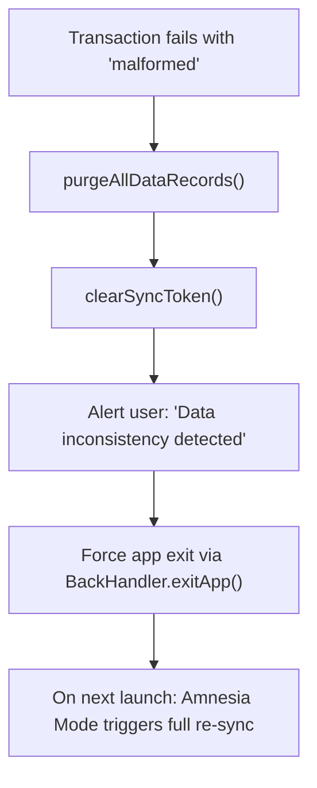

# Sync Engine

The Sync Engine (`lib/sync-engine.ts`) is the bridge between the Convex cloud backend and the local SQLite cache. It receives **Delta Payloads** containing tasks and instances that have changed since the last sync, and atomically upserts them into the local database.

---

## Delta Payload Structure

Every sync cycle, the Convex backend computes a differential payload based on the client's last known sync token:

```typescript
export interface DeltaPayload {
  tasks: any[];       // Tasks modified since last sync
  instances: any[];   // Instances modified since last sync
  sync_token: number; // New watermark for next sync cycle
}
```

The sync token is stored in `expo-secure-store` (encrypted, persisted across app restarts) — not in SQLite, which can be wiped during Nuke and Pave operations.

---

## The Freshness Guard

The Freshness Guard is the critical anti-corruption mechanism that prevents background sync from overwriting the user's fresh edits with stale cloud data.

**The problem it solves:** A user edits a task at `T=100`. The background sync fires at `T=101` with data from `T=90` (because the Convex query was slow). Without the Freshness Guard, the sync would silently overwrite the user's edit.

```typescript
// For each incoming task from Convex:
const existing = await db.getFirstAsync<{ updated_at: number }>(
  `SELECT updated_at FROM local_tasks WHERE id = ?`, [task._id]
);

const incomingTime = task.updated_at || task._creationTime || 0;

if (existing && existing.updated_at > incomingTime) {
  // LOCAL IS NEWER — discard the stale Convex payload
  Logger.warn(`Freshness Guard: Discarding STALE payload for task ${task._id}`);
  skippedTaskIds.add(task._id);
  continue;
}
```

The guard operates at two levels:

| Level | Protection |
| :--- | :--- |
| **Task-level** | Compares `updated_at` timestamps. If local is newer, the entire task is skipped AND its child instances are also skipped. |
| **Instance-level** | Checks the `is_manual_edit` flag. If the local instance has been manually edited but the incoming payload does not reflect that edit, the incoming data is discarded. |

---

## Atomic Transaction Safety

All multi-row writes are wrapped in a single `withTransactionAsync()` call. If any row fails, the entire batch rolls back atomically:

```typescript
await db.withTransactionAsync(async () => {
  // 1. Upsert all tasks (INSERT OR REPLACE)
  for (const task of payload.tasks) { ... }

  // 2. Upsert all instances (INSERT OR REPLACE)
  for (const instance of payload.instances) { ... }
});

// 3. Persist sync token ONLY after successful transaction
await SecureStore.setItemAsync(SYNC_TOKEN_KEY, payload.sync_token.toString());
```

<Info>
The sync token is written **outside** the transaction, **after** it succeeds. This means if the transaction fails, the token is not updated, and the next sync cycle will re-fetch the same data — guaranteeing at-least-once delivery without data loss.
</Info>

---

## Automatic Corruption Recovery

If the transaction throws a `malformed` or `disk I/O` error, the engine enters an automatic recovery protocol:



This prevents the app from entering a death loop where corrupted data causes every subsequent transaction to fail.

---

## HydrationEngine

The `HydrationEngine` is an invisible React component mounted at the root of the app tree. It runs the `useHydrationSync()` hook, which:

1. Monitors the authenticated session state
2. Reads the local sync token from SecureStore
3. If the token is missing (Amnesia Mode), fetches a full payload from Convex
4. If the token exists, fetches only the delta since the last sync
5. Passes the payload to `ingestDeltaPayload()` for atomic upsert
6. After successful ingestion, triggers `scheduleNextAlarm()` to re-arm the hardware

```typescript
// components/system/HydrationEngine.tsx
export function HydrationEngine() {
  useHydrationSync(); // Runs invisibly, pushing to SQLite on the background thread
  return null;        // Renders nothing — pure side-effect component
}
```
