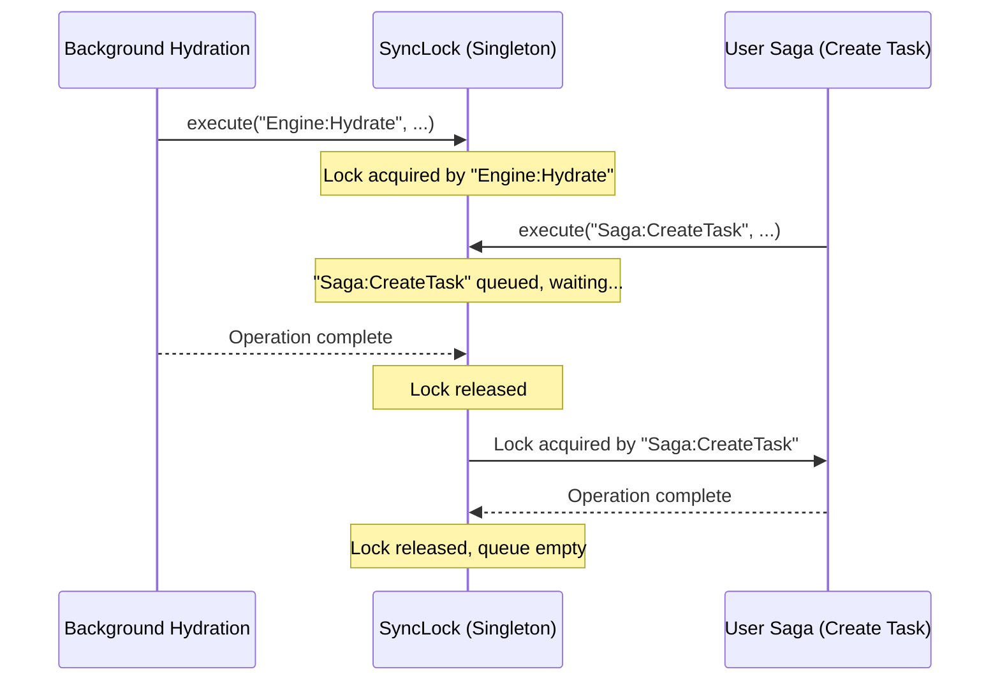
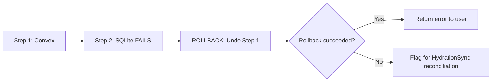

# Write Gate and Sync Lock

SQLite is a **single-writer database**. If multiple JavaScript operations attempt concurrent transactions, the native bridge throws `SQLITE_BUSY` or `SQLITE_LOCKED` errors. CommitT solves this with two complementary systems: a **Promise-chain mutex** and a **Saga-pattern orchestrator**.

---

## Sync Lock Mutex (V2)

The `SyncLock` (`lib/sync-lock.ts`) is a **singleton Promise-chain mutex** that serializes ALL database writes and hardware alarm sync triggers across the entire application.

```typescript
import { syncLock } from '@/lib/sync-lock';

// Every database write must go through the lock
const result = await syncLock.execute(
  "Saga:CreateCommitment",  // Source name for diagnostics
  async () => {
    await db.withTransactionAsync(async () => {
      // Write operations here
    });
  },
  15_000  // Timeout: 15 seconds
);
```

### How the Queue Works

Operations are chained onto a single Promise. Each new caller waits for all preceding callers to finish before executing:



### Timeout Circuit Breaker

Every lock holder has a **hard time limit** (default: 30 seconds). If an operation exceeds this, the lock is forcibly released via `Promise.race`:

```typescript
const result = await Promise.race([
  operation(),
  new Promise<never>((_, reject) => {
    setTimeout(() => {
      reject(new Error(
        `TIMEOUT: "${sourceName}" exceeded ${timeoutMs}ms. ` +
        `Forcibly releasing lock to prevent system deadlock.`
      ));
    }, timeoutMs);
  })
]);
```

<Warning>
The timeout does NOT abort the underlying operation (you cannot cancel a native SQLite transaction). It simply releases the lock so the next writer does not starve. The timed-out operation's result is silently discarded.
</Warning>

### Manual Resync Awareness

The `SyncLock` exposes a public `isManualResyncActive` flag. When set to `true`, the HydrationSync engine suppresses all reconciliation attempts to avoid fighting the manual resync for the lock:

```
Manual Resync starts → sets flag → acquires lock → nukes DB → downloads → ingests → clears flag
                                                                                      |
HydrationSync wakes up → checks flag → sees true → gracefully defers                  |
                                                                                      |
Without this flag: HydrationSync sees empty token → panics → "AMNESIA!" → fights for lock
```

### Cold Boot Reset

On app startup, the lock is explicitly reset to clear any stale state from a prior crash:

```typescript
syncLock.reset(); // Called in SQLiteProvider's onInit
```

This handles the edge case where Android ROMs (notably Lenovo) keep the process alive after a swipe-kill when an Accessibility Service is active.

---

## Triple-Write Orchestrator

The `TripleWriteOrchestrator` (`lib/triple-write-orchestrator.ts`) is a **Saga pattern** implementation that coordinates multi-step write operations with automatic rollback on failure.

```typescript
const saga = new TripleWriteOrchestrator(context);

saga
  .addStep("Convex Mutation", 
    async (ctx) => await convexMutation(ctx),
    async (ctx, result) => await convexRollback(result) // Compensating function
  )
  .addStep("Local SQLite Write",
    async (ctx, prev) => await sqliteInsert(prev),
    async (ctx, result) => await sqliteDelete(result)
  )
  .addStep("Hardware Alarm Sync",
    async (ctx) => await scheduleNextAlarm()
    // No compensating function — alarms are idempotent
  );

const { success, error, rollbackFailed } = await saga.execute();
```

### Per-Step Timeouts

Each step races against its own timeout (default: 15 seconds). If a Convex mutation hangs due to a slow network, the timeout fires, and the orchestrator skips to the rollback phase:

```typescript
private executeWithTimeout<TResult>(step, previousResults): Promise<TResult> {
  return Promise.race([
    step.execute(this.contextSnapshot, previousResults),
    new Promise<never>((_, reject) => {
      setTimeout(() => {
        reject(new Error(`"${step.name}" timed out after ${step.timeoutMs}ms.`));
      }, step.timeoutMs);
    })
  ]);
}
```

### Rollback Behavior

If Step 2 (SQLite) fails, the orchestrator automatically runs Step 1's **compensating function** to undo the Convex mutation. Steps are rolled back in reverse order:



If a compensating function itself fails, the `rollbackFailed` flag is set to `true`, signaling the HydrationSync engine to perform a full reconciliation on the next cycle.
