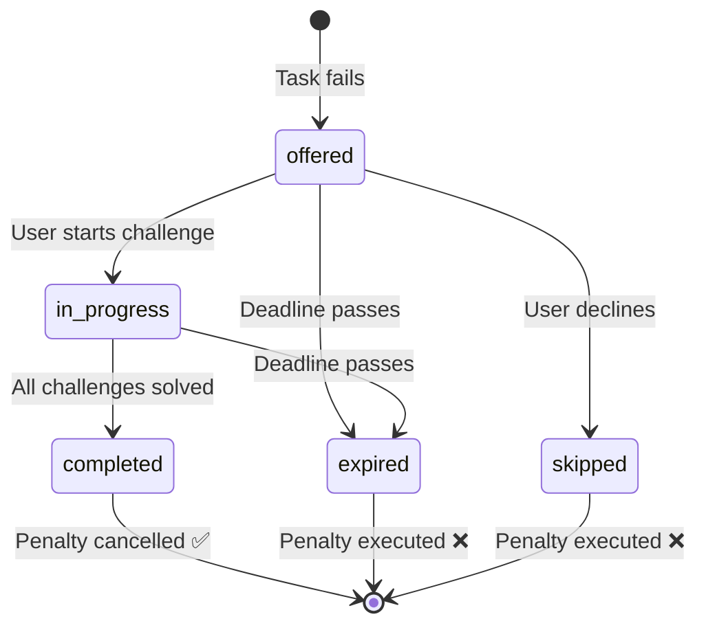

# Database Schema

The Convex backend defines **10 tables** organized around a domain-driven design. Each table includes extensive indexing for high-performance queries.

## Core Tables

### `tasks`
The master commitment definitions. Each task represents a recurring accountability contract created by a user.

```typescript
tasks: defineTable({
  assigner_id: v.string(),      // Who created the commitment
  assignee_id: v.string(),      // Who must fulfill it
  title: v.string(),
  description: v.string(),
  visibility: visibilityEnum,   // "private" | "public" | "partner_only"
  recurrence: v.object({...}),  // Complex recurrence rules
  conditions: v.array({...}),   // Location, app blocking, photo verification
  config: v.object({...}),      // Verification style, alarms, grace periods
  penalty: v.optional({...}),   // The "punishment contract"
  penalty_waiver: v.optional({...}),  // Second-chance challenge rules
  strict_until: v.optional(v.number()),  // Mutation lock timestamp
  strict_duration_days: v.optional(v.number()),
  created_at: v.number(),
  updated_at: v.number(),
})
```

**Indexes:** `by_assignee_id`, `by_assigner_id`, `by_created_at`, `by_updated_at`

### `taskInstances`
Individual occurrences of commitments. Generated from recurrence rules and snapshotted with the parent task's penalty/waiver configuration at creation time.

<Info>
**Immutable Snapshots:** The `penalty` and `penalty_waiver` fields on instances are FROZEN copies from the parent task. They are never updated, even if the user later edits the task. This prevents retroactive contract manipulation (e.g., setting ₹500 penalty → failing → quickly editing to ₹10).
</Info>

Key fields:

| Field | Type | Description |
|---|---|---|
| `task_id` | `v.id("tasks")` | Parent task reference |
| `status` | Enum | `pending`, `proceeding`, `completed`, `failed`, `waiver_active` |
| `start` / `end` | `v.number()` | Commitment window (epoch ms) |
| `strict_until` | `v.number()` | If set, instance cannot be deleted until this time |
| `checkpoints` | Array | Stay-throughout verification pings |
| `scheduled_job_id` | `v.id("_scheduled_functions")` | Linked durable verification job |
| `enforcement_job_id` | `v.id("_scheduled_functions")` | Linked penalty execution job |
| `waiver_state` | Object | Mutable runtime state for active waiver challenges |

**Indexes:** `by_task`, `by_task_end`, `by_assignee`, `by_assignee_start`, `by_status`, `by_task_status`, `by_assignee_status`, `by_start`, `by_end`

### The Steel Vault (Strict Mode)

When `strict_until` is set on an instance, the backend **rejects all mutations** (edits, deletions) until that timestamp passes:

```
User creates task with 7-day strict lock
  → strict_until = Date.now() + (7 * 24 * 60 * 60 * 1000)
  → For the next 7 days, the task and its instances CANNOT be modified or deleted
  → This is the core "self-binding" mechanism
```

## Waiver Lifecycle

The `waiver_state` object tracks the progression of a second-chance challenge:



The `penalty_job_id` field stores the ID of a **Convex durable scheduled function** — the "bomb" that fires the penalty when the waiver deadline expires. The only way to defuse it is by completing the waiver challenge, which calls `ctx.scheduler.cancel(waiver_state.penalty_job_id)`.

## Preset Tables

### `accountabilityPresets`
Persistent "contract templates" that remember a user's preferred penalty and waiver settings. Used for zero-friction task creation.

### `locationPresets`
Saved locations with GPS coordinates and radius. Indexed by recency and popularity for smart suggestions.

### `digitalCommitmentPresets`
Saved app/website blocking lists. Named presets like "Social Media Block" for quick reuse.

### `behavioralRulePresets`
Saved verification configurations (check-in style, alarm timing, grace periods).

## Security Tables

### `userDevices`
Maps authenticated users to physical device signatures (Android SSAID). Prevents "Account Switching" bypass attempts:

```typescript
userDevices: defineTable({
  userId: v.string(),
  deviceId: v.string(),   // Android SSAID
  lastSeen: v.number(),
  metadata: v.optional(v.object({
    model: v.optional(v.string()),
    osVersion: v.optional(v.string()),
  })),
})
```

### `auditLogs`
Central ledger for all user events — successes, failures, executed penalties. Powers the frontend notification feed and history dashboard.

### `files`
Unified asset registry for all binary files (photos, videos). Single-table design for unified security, performance, and garbage collection.

## Backend Architecture

### Domain-Driven Structure

```
packages/backend/convex/
├── api/                    # External-facing mutations & queries
│   ├── commitments/        # Task CRUD operations
│   ├── instances/          # Instance management
│   ├── logs/               # Audit log queries
│   ├── notifications/      # Push notification triggers
│   ├── security/           # Device binding & verification
│   └── sync/               # Delta sync endpoint
├── core/                   # Business logic (pure functions)
│   ├── commitments/        # Task lifecycle rules
│   ├── enforcement/        # Blocking decision engine
│   ├── instances/          # Instance generation & management
│   ├── penalties/          # Penalty dispatching
│   ├── verification/       # Checkpoint validation
│   └── waivers/            # Waiver challenge verification
├── execution/              # Side-effect handlers
│   ├── penalties/          # Penalty job execution
│   ├── scheduling/         # Durable function scheduling
│   ├── verification/       # Heartbeat verification jobs
│   └── watchdog.ts         # Self-healing cron
├── db/
│   └── schema.ts           # The schema (this page)
├── crons.ts                # Scheduled jobs (Watchdog: every 1h)
└── http.ts                 # HTTP routes (Better Auth)
```

### Self-Healing Watchdog

A **hourly cron job** scans all tasks and detects "orphaned" instances — those with `status: pending` but no linked `scheduled_job_id`. When found, it automatically re-links them to a new durable scheduled function:

```typescript
crons.interval(
  "Self-healing task scheduler sync",
  { hours: 1 },
  internal.execution.watchdog.watchdogSync
);
```
