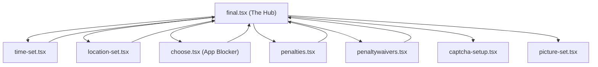

# Commitment Wizard

The commitment wizard uses a **Hub-and-Spoke** architecture rather than a traditional linear step-by-step flow. The user starts at a central hub screen and branches out to specialized spoke screens to configure individual aspects of their commitment.

---

## Hub-and-Spoke Architecture



---

## The Hub -- final.tsx

The hub screen (final.tsx) serves as both the commitment summary and the commit trigger:

- Reads the full TaskDraft from useTaskDraftStore to display a live preview of all configured conditions
- Shows attached time slots, locations, blocklists, penalties, and waivers
- Contains the "Commit" button that triggers the Triple-Write Orchestrator
- Gates submission behind the 8-point permission audit

---

## Layout-Level Preset Hydration

The (create-commit)/_layout.tsx calls usePresetHydration() at mount time. This one-shot hook fetches all saved presets from the Convex backend and populates usePresetStore.

```typescript
export default function CreateCommitLayout() {
  usePresetHydration(); // One-shot hydration before any spoke mounts
  return <Stack screenOptions={{ animation: "slide_from_right" }}>...</Stack>;
}
```

---

## Spoke Screens

| Spoke | File | Purpose |
| :--- | :--- | :--- |
| **Time Setup** | time-set.tsx | Day picker, time windows, per-slot attachments |
| **Location Setup** | location-set.tsx | Google Maps integration, geofence radius, address search |
| **App Blocker** | choose.tsx | Three-tab interface for selecting apps, websites, and search |
| **Penalties** | penalties.tsx | Routes to sub-screens for photo, email, money penalties |
| **Waivers** | penaltywaivers.tsx | CAPTCHA count, paragraph, intensity configuration |
| **CAPTCHA Setup** | captcha-setup.tsx | Detailed CAPTCHA waiver configuration |
| **Photo Setup** | picture-set.tsx | Photo verification camera configuration |
| **Partner Select** | partner-select.tsx | Select accountability partner |

---

## State Flow

As the user navigates between spokes, all changes are written to useTaskDraftStore in real-time. No data touches the database until the final "Commit" action. This allows the user to freely navigate back and forth between spokes without data loss.
