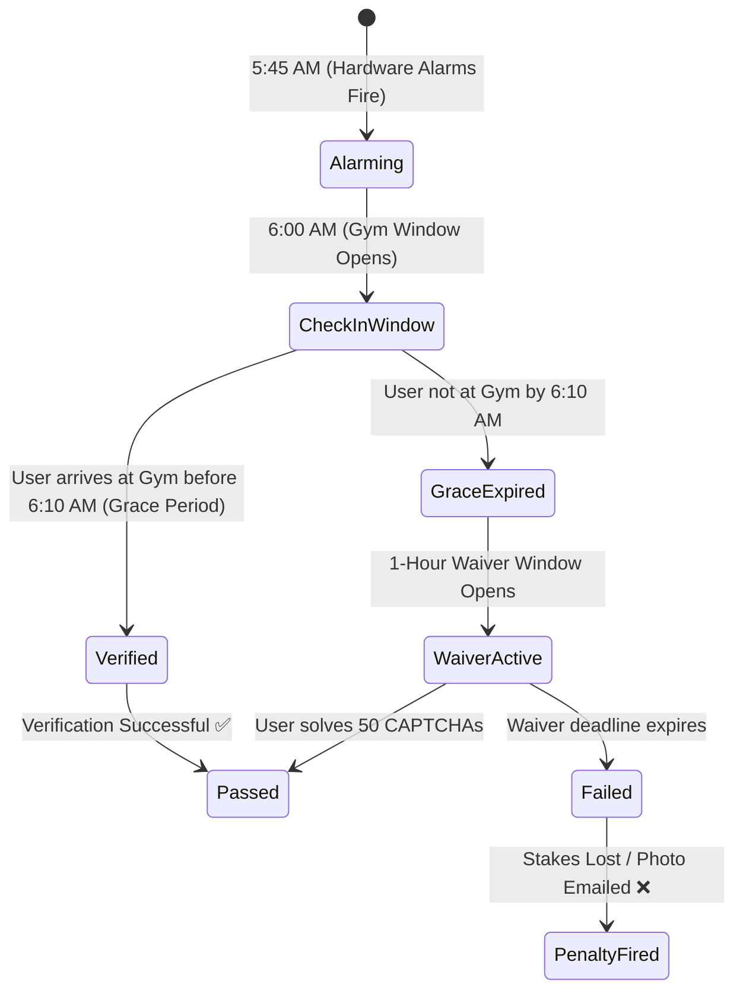
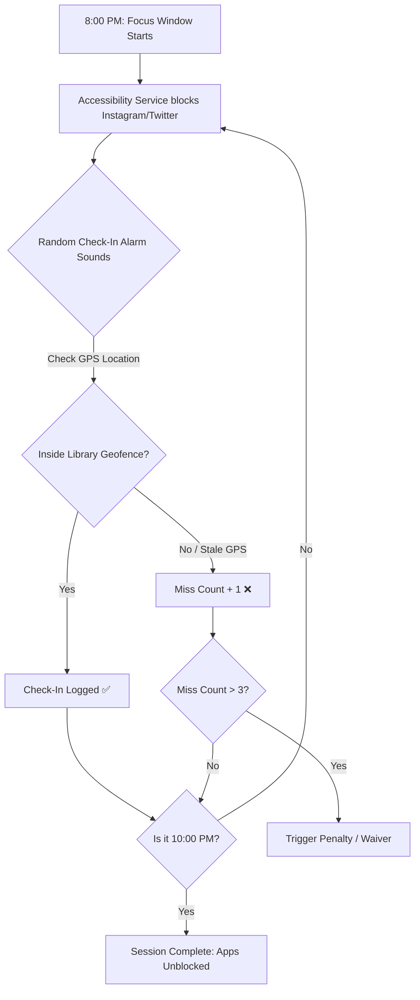
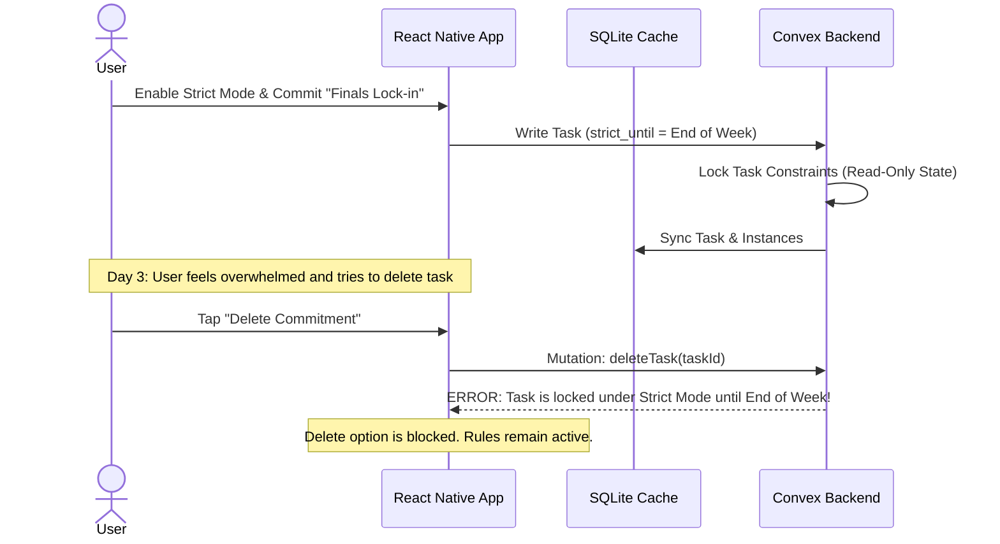
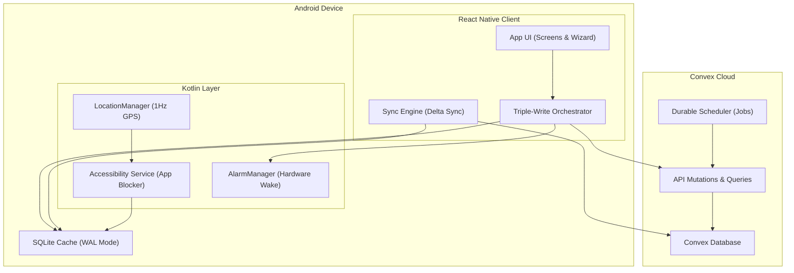

# Welcome to CommitT

CommitT is a self-binding accountability system that enforces commitments through hardware-level app blocking, 1Hz GPS geofencing, and automated penalties. Unlike standard to-do apps that rely on willpower, CommitT makes it physically impossible to break your rules.

---

## Real-World Use Cases

See how CommitT handles real-life scenarios to enforce habits, prevent distractions, and lock you in during critical periods.

### 1. Gym Consistency (The "Just Show Up" Model)

**The Problem:** You keep skipping morning workouts. You snooze your alarm at 5:45 AM and tell yourself you'll go tomorrow.

**How CommitT Solves It:**
You configure a commitment named **"Gym Workout"** with the following rules:
*   **Time Slot:** Mon, Wed, Fri from `6:00 AM – 7:30 AM`.
*   **Location:** *Fitty Gym VIT* coordinates (50-meter geofence radius).
*   **Grace Time:** `10 minutes` (you must arrive and check in by 6:10 AM).
*   **Alarms:** Armed to start ringing `15 minutes before` (5:45 AM) every `2 minutes` until verified.
*   **Penalty:** Stake `$10` or configure an *Embarrassing Photo* to be emailed to your chosen address on failure.
*   **Waiver:** Solve `50 CAPTCHAs` within a 1-hour deadline to defuse the penalty if you fail.

---

### 2. Deep Study Sessions (The "Stay Throughout" Model)

**The Problem:** You go to the library to study, but you end up spending hours doomscrolling Instagram, Twitter, and Reddit on your phone.

**How CommitT Solves It:**
You configure a commitment named **"Library Focus"** with the following rules:
*   **Time Slot:** Daily from `8:00 PM – 10:00 PM`.
*   **Location:** *VIT Central Library* coordinates.
*   **App Blocklist:** Instagram, Twitter, and Reddit are selected.
*   **Verification Mode:** **Stay Throughout** (Intensity: Moderate, Max Missed In: 3).
*   **How it behaves:** 
    1.  At 8:00 PM, the accessibility service detects if you try to open social apps and immediately displays a full-screen blocking overlay.
    2.  At random times throughout the session (which you cannot predict), the phone sounds a check-in alarm. You must verify that you are still inside the library.
    3.  If you step out of the geofence or fail to answer a check-in, it counts as a miss. If you accumulate more than 3 misses, the penalty activates.

---

### 3. Exam Lock-In Week (The "Strict Mode" Sprint)

**The Problem:** Finals are in a week. You need to lock in and study 8 hours a day. You set up blockers, but you know that when you get stressed on day 3, you will edit or delete the tasks to escape them.

**How CommitT Solves It:**
You configure a high-stakes, non-repeating sprint named **"Finals Lock-in"**:
*   **Recurrence:** Uncheck **Repeat** (runs for this week only, then expires).
*   **Schedule:** Two daily time blocks: `9:00 AM – 1:00 PM` and `2:00 PM – 6:00 PM`.
*   **Enforcement:** Block Apps preset ("Distractions") + AI input: *"Block all entertainment and streaming websites"*.
*   **Strict Mode:** **Enabled.** Once saved, the Convex database flags this commitment as immutable. Edit and delete operations are rejected on the server until the week ends.
*   **Verification Mode:** **Stay Throughout** (Intensity: Strict, Max Missed In: 1).
*   **Penalty:** Stake `$50` + *Embarrassing Photo* penalty.
*   **Waiver:** Solve `200 CAPTCHAs` to waive.

---

## Technical Architecture Overview

CommitT uses a three-tier architecture designed around a **zero-trust local client**. Because the user is considered the adversary, every layer is built to fail closed and resist tampering.

*   **Triple-Write Orchestrator:** Every commitment write utilizes a saga pattern that must complete successfully across the Convex Cloud, the local SQLite database, and the native hardware alarm scheduler.
*   **Fail-Closed Access:** The system-level Accessibility Service queries SQLite directly. If the database is locked, unreadable, or if location tracking is disabled, the system defaults to blocking target applications.
*   **FBE Bypass:** Hardware alarms are registered with Android's `AlarmManager` and a `BOOT_COMPLETED` receiver. If the device restarts, alarms are re-armed before the user inputs their lock screen PIN.

---

## Feature Index

CommitT's full feature set is organized into the following areas:

### Core Configuration
*   **Task & Instances:** Commitments generate independent, immutable task instances so historic records cannot be retrospectively altered.
*   **Flexible Time Slots:** Configure custom days with repeat toggles (monthly recurring or one-week sprint) and multiple focus windows.
*   **Per-Time-Slot Customization:** Attach specific locations, app blocklists, and verification rules to individual time slots within a single commitment.
*   **Presets:** Save frequently used Locations, Blocklists, and Verification Rules for rapid commitment creation.

### Verification & Enforcement
*   **Digital Blocker:** Block installed packages, specific web domains, or use AI description inputs to auto-generate block rules.
*   **Location Geofencing:** Real-time geofence checks via a 1Hz GPS location stream.
*   **Just Show Up Mode:** Verifies your presence once during a configurable grace window.
*   **Stay Throughout Mode:** Sound unpredictable check-in alarms throughout the focus window with customizable frequency and miss allowances.

### Penalties & Waivers
*   **Durable Penalties:** Missed check-ins schedule serverless cloud "time bombs" that execute automatically.
*   **Stake Penalties:** Tie commitments to real financial stakes.
*   **Social Accountability:** Send proof photos or videos to accountability email addresses on failure.
*   **Waiver Challenges:** Defuse scheduled penalties by completing countdown challenges (solving up to 400 CAPTCHAs, transcribing long texts, or redoing tasks).

### Security & Integrity
*   **Strict Mode:** Lock commitments to make them completely un-editable and un-deletable.
*   **Uninstall Protection:** Require Device Admin permissions to prevent the app from being uninstalled.
*   **Device Marriage:** Authenticate and bind account sessions to unique hardware signatures to prevent remote cheating.
*   **Nuke & Pave Recovery:** Automatically rebuild, verify, and re-sync the local database cache in the event of I/O failures.
