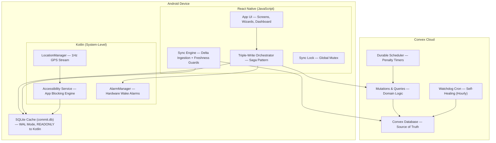
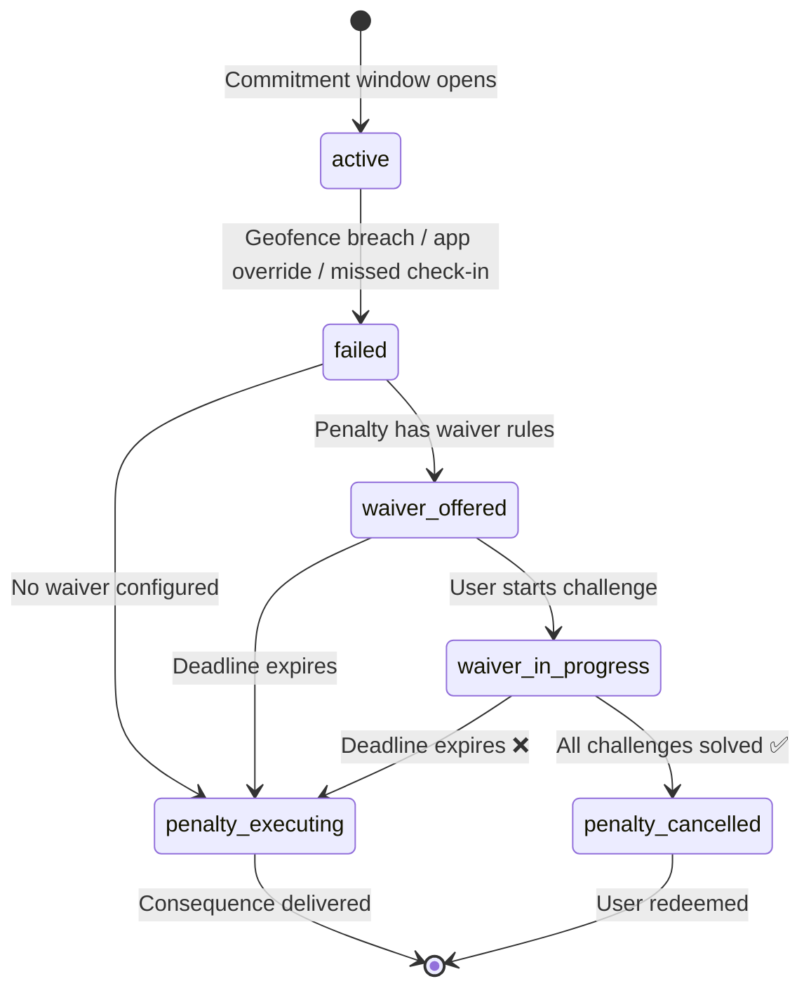

# CommitT Overview

CommitT is a self-binding accountability system where your commitments are enforced through hardware-level app blocking, real-time GPS geofencing, and penalties that execute automatically if you fail. Unlike to-do apps that rely on willpower, CommitT makes it physically impossible to break your own rules.

CommitT provides a native Android enforcement engine, a Convex cloud backend for real-time sync, and an offline-first SQLite cache. Together they form a system where creating a commitment is easy — but escaping one is not.

The following diagram shows the architecture that makes this possible. We'll start at the bottom (the cloud) and work our way up to the enforcement layer on the device.



## Commitments

[Commitments](/architecture/overview) are the core primitive. A commitment is a self-binding contract with a time window, recurrence rules, and attached conditions. Once created, a commitment generates **task instances** — individual occurrences that are independently tracked and enforced.

The key design principle: when a task instance is created, the penalty and waiver rules are **frozen** onto it as an immutable snapshot. Even if you later edit the parent task, existing instances enforce the original contract. This prevents retroactive manipulation.

```typescript
// Creating a commitment triggers the Triple-Write Orchestrator
const saga = new TripleWriteOrchestrator(context);

saga
  .addStep("Convex Cloud",       // Step 1: Persist to source of truth
    async () => await createTask(draft),
    async (result) => await deleteTask(result.id)  // Compensator
  )
  .addStep("Local SQLite",       // Step 2: Update local cache
    async (prev) => await sqliteInsert(prev),
    async (result) => await sqliteDelete(result)
  )
  .addStep("Hardware Alarms",    // Step 3: Arm the Android AlarmManager
    async () => await scheduleNextAlarm()
  );

const { success, error } = await saga.execute();
```

Every write operation goes through this three-step Saga. If Step 2 fails, Step 1 is automatically rolled back. If Step 3 fails, both Step 2 and Step 1 are undone. Your data is never left in a half-written state.

## Enforcement

The [enforcement engine](/native-modules/overview) is a native Android **Accessibility Service** written in Kotlin. It runs as a system-level process that intercepts every app launch on the device.

When a commitment is active, the service reads the local SQLite database and decides whether to allow or block the foreground app. If the app is on the blocked list, a full-screen overlay appears instantly — before the target app's first frame renders.

For location-based commitments, the service maintains a **1Hz GPS stream** (one update per second) using the raw Android `LocationManager`. Geofence checks use `Location.distanceBetween()` for deterministic, sub-second enforcement — no Google Geofencing API batching delays.

```kotlin
// The Accessibility Service intercepts every window change
override fun onAccessibilityEvent(event: AccessibilityEvent) {
    if (event.eventType == TYPE_WINDOW_STATE_CHANGED) {
        val packageName = event.packageName?.toString() ?: return
        val isBlocked = checkBlockingRules(packageName)
        if (isBlocked) {
            showBlockingOverlay()  // Full-screen overlay, no escape
        }
    }
}
```

The service operates on a **fail-closed** policy. If the GPS fix is stale (older than 30 seconds), the database is unreadable, or the sync token is missing — the service blocks by default. Ambiguity is treated as a violation.

<Warning>
The Accessibility Service opens a **READONLY** SQLite connection. If it opened a read-write connection, it would compete for the WAL writer lock with the JavaScript thread, causing immediate database corruption on eMMC storage devices.
</Warning>

## Penalties & Waivers

When a commitment fails — either by a missed check-in, a geofence breach, or a blocked app override — the [penalty system](/backend/schema) activates.

Penalties are backed by **Convex durable scheduled functions** — serverless "time bombs" that execute after a configurable deadline. The only way to defuse them is by completing a waiver challenge.



Waiver challenges are configurable CAPTCHA-style tasks that must be completed within a countdown window. The `penalty_job_id` on the instance points to a live Convex scheduled function. Completing the waiver calls `ctx.scheduler.cancel(penalty_job_id)` to defuse it.

## Sync & Offline

The [Sync Engine](/architecture/sync-engine) keeps the local SQLite cache synchronized with the Convex cloud using **delta-based ingestion**. Only records modified since the last sync token are downloaded.

Every incoming record passes through a **Freshness Guard** before being written. If the local copy has a newer `updated_at` timestamp than the incoming cloud data, the cloud data is silently discarded. This prevents background sync from overwriting a user's recent manual edits — the "Phantom Overwrite" bug that plagued earlier versions.

```typescript
// Freshness Guard: local data wins if it's newer
const existing = await db.getFirstAsync(
  `SELECT updated_at FROM local_tasks WHERE id = ?`, [task._id]
);

if (existing && existing.updated_at > incomingTimestamp) {
  skippedIds.add(task._id);  // DISCARD: local is newer
  continue;
}
```

If the database is ever corrupted (schema mismatch, `malformed` error, disk I/O failure), the engine triggers the **Nuke & Pave** protocol: drop all tables, recreate the V12 schema, and enter "Amnesia Mode" — a full re-download from Convex. The sync token is stored in Android Keystore (via Expo SecureStore), not SQLite, so it survives database destruction.

## Security

CommitT's security model is designed around one assumption: **the user is the adversary**. Every bypass vector is addressed:

| Threat | Defense |
|---|---|
| Rooted device | JailMonkey detection → entire app tree unmounts, replaced with violation screen |
| Delete task after failing | Instance-Dependent Architecture — orphaned instances survive parent deletion |
| Edit penalty after failing | Immutable penalty snapshots frozen at instance creation |
| Disable Accessibility Service | Settings Protection — service detects navigation to Accessibility Settings and redirects |
| Kill the app | Hardware AlarmManager wakes the device independently of app lifecycle |
| Reboot to clear alarms | `BOOT_COMPLETED` receiver + Device Protected Storage (FBE bypass) re-arms all alarms before PIN unlock |
| Stale GPS / disabled location | Fail-closed — 30-second staleness threshold triggers blocking overlay |

The entire system operates on `strict_until` timestamps. When a user enables Strict Mode with a 7-day lock, the backend **rejects all mutations** (edits, deletions) on that task and its instances until the lock expires. The frontend simply cannot construct a valid request to modify it.

## Putting it all together

Let's follow what happens when a user creates a commitment to "Study at the library, 9AM–12PM, block Instagram and Twitter":

1. The **multi-step wizard** (`(create-commit)/`) collects the commitment details, conditions, and penalty contract into a `TaskDraft` in the Zustand store.

2. On the final screen, the **Triple-Write Orchestrator** fires:
   - **Step 1**: Convex mutation creates the `task` document and generates the first `taskInstance` with a frozen penalty snapshot and a `scheduled_job_id` pointing to a durable verification function.
   - **Step 2**: The local SQLite cache receives the new task and instance via `INSERT OR REPLACE` inside a transaction protected by the **Sync Lock** mutex.
   - **Step 3**: The native `scheduler-module` reads the instance's `start_time` and programs an exact Android `AlarmManager` alarm.

3. At 9:00 AM, the hardware alarm fires. The **Accessibility Service** wakes up, opens a READONLY connection to `commit.db`, reads the active instance, and begins enforcement:
   - Instagram launch → intercepted → blocking overlay shown
   - GPS stream confirms user is within 200m of the library coordinates
   - Checkpoint pings log attendance every 15 minutes

4. At 12:00 PM, the Convex **durable scheduled function** runs. It checks the instance's checkpoint log. If all pings are green → `status: completed`. If any are missing → `status: failed` → waiver offered or penalty fired.

5. In the background, the **Watchdog cron** (hourly) scans for orphaned instances — those with `status: pending` but no linked `scheduled_job_id`. If found, it re-links them to prevent silent failures.

## Learn more

Now that you understand how CommitT's pieces fit together, explore the detailed guides:

<CardGroup cols={2}>
  <Card title="Sync Engine Deep Dive" icon="arrows-rotate" href="/architecture/sync-engine">
    Delta payloads, Freshness Guards, corruption recovery, and the Amnesia Mode protocol.
  </Card>
  <Card title="Local Database (V12)" icon="database" href="/architecture/local-database">
    The Nuke & Pave strategy, Instance-Dependent Architecture, and WAL journaling.
  </Card>
  <Card title="Write Gate & Sync Lock" icon="lock" href="/architecture/write-gate">
    The global mutex, timeout circuit breakers, and the Triple-Write Saga pattern.
  </Card>
  <Card title="Backend Schema" icon="server" href="/backend/schema">
    All 10 Convex tables, the Steel Vault strict mode, and the self-healing Watchdog.
  </Card>
</CardGroup>
