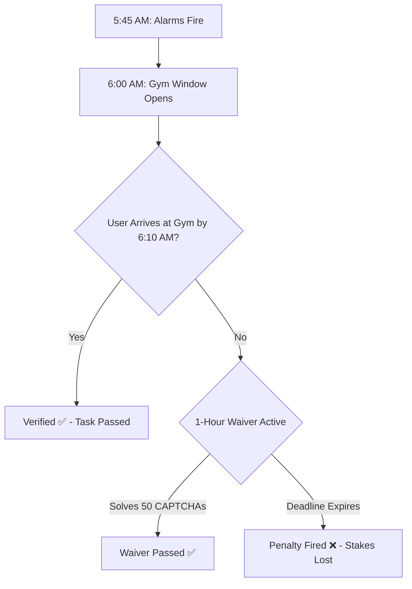
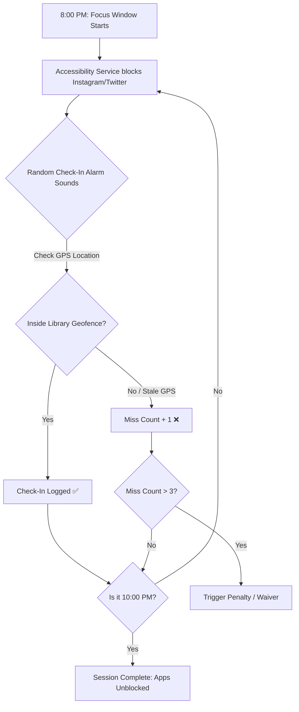
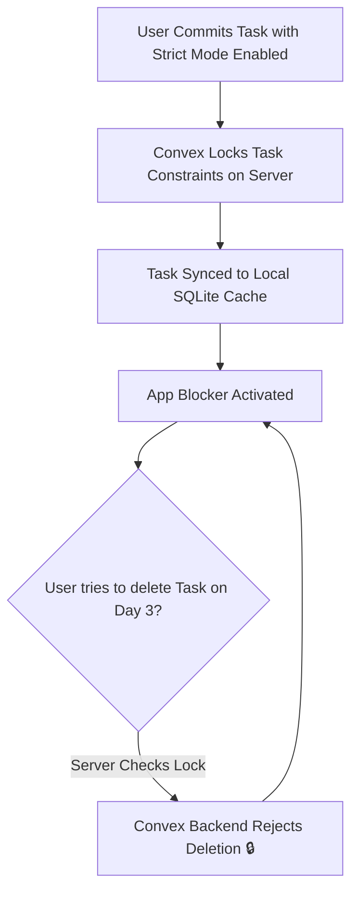

# Welcome to CommitT

CommitT is a self-binding accountability system that enforces commitments through hardware-level app blocking, 1Hz GPS geofencing, and automated penalties. Unlike standard to-do apps that rely on willpower, CommitT makes it physically impossible to break your rules.

---

## Real-World Use Cases

See how CommitT handles real-life scenarios to enforce habits, prevent distractions, and lock you in during critical periods.

### 1. Gym Consistency (The "Just Show Up" Model)

**The Problem:** You keep skipping morning workouts. You snooze your alarm at 5:45 AM and tell yourself you'll go tomorrow.

**How CommitT Solves It:**
You configure a commitment named **"Gym Workout"** with the following rules:
*   **Time Slot:** Mon, Wed, Fri from `6:00 AM – 7:30 AM`.
*   **Location:** *Fitty Gym VIT* coordinates (50-meter geofence radius).
*   **Grace Time:** `10 minutes` (you must arrive and check in by 6:10 AM).
*   **Alarms:** Armed to start ringing `15 minutes before` (5:45 AM) every `2 minutes` until verified.
*   **Penalty:** Stake `$10` or configure an *Embarrassing Photo* to be emailed to your chosen address on failure.
*   **Waiver:** Solve `50 CAPTCHAs` within a 1-hour deadline to defuse the penalty if you fail.

---

### 2. Deep Study Sessions (The "Stay Throughout" Model)

**The Problem:** You go to the library to study, but you end up spending hours doomscrolling Instagram, Twitter, and Reddit on your phone.

**How CommitT Solves It:**
You configure a commitment named **"Library Focus"** with the following rules:
*   **Time Slot:** Daily from `8:00 PM – 10:00 PM`.
*   **Location:** *VIT Central Library* coordinates.
*   **App Blocklist:** Instagram, Twitter, and Reddit are selected.
*   **Verification Mode:** **Stay Throughout** (Intensity: Moderate, Max Missed In: 3).
*   **How it behaves:** 
    1.  At 8:00 PM, the accessibility service detects if you try to open social apps and immediately displays a full-screen blocking overlay.
    2.  At random times throughout the session (which you cannot predict), the phone sounds a check-in alarm. You must verify that you are still inside the library.
    3.  If you step out of the geofence or fail to answer a check-in, it counts as a miss. If you accumulate more than 3 misses, the penalty activates.

---

### 3. Exam Lock-In Week (The "Strict Mode" Sprint)

**The Problem:** Finals are in a week. You need to lock in and study 8 hours a day. You set up blockers, but you know that when you get stressed on day 3, you will edit or delete the tasks to escape them.

**How CommitT Solves It:**
You configure a high-stakes, non-repeating sprint named **"Finals Lock-in"**:
*   **Recurrence:** Uncheck **Repeat** (runs for this week only, then expires).
*   **Schedule:** Two daily time blocks: `9:00 AM – 1:00 PM` and `2:00 PM – 6:00 PM`.
*   **Enforcement:** Block Apps preset ("Distractions") + AI input: *"Block all entertainment and streaming websites"*.
*   **Strict Mode:** **Enabled.** Once saved, the Convex database flags this commitment as immutable. Edit and delete operations are rejected on the server until the week ends.
*   **Verification Mode:** **Stay Throughout** (Intensity: Strict, Max Missed In: 1).
*   **Penalty:** Stake `$50` + *Embarrassing Photo* penalty.
*   **Waiver:** Solve `200 CAPTCHAs` to waive.

---

## Feature Index

Here is the complete list of capabilities you can configure with CommitT:

### Setup & Permissions

<CardGroup cols={2}>
  <Card title="OS Permissions Audit" icon="shield-halved" href="/platform/permissions">
    Prerequisite checks for all 8 Android system permissions before activation to guarantee background persistence.
  </Card>
  <Card title="Device Admin Lock" icon="gavel" href="/platform/permissions">
    Enables Device Administrator access to block any attempts to uninstall the application to escape active commitments.
  </Card>
  <Card title="Appear On Top" icon="window-restore" href="/platform/permissions">
    Draws full-screen overlay block screens directly over target applications before their first frame renders.
  </Card>
  <Card title="Battery Optimization Bypass" icon="battery-empty" href="/platform/permissions">
    Disables system battery-saver restrictions so background tasks and verification services stay alive.
  </Card>
</CardGroup>

### Core Configuration

<CardGroup cols={2}>
  <Card title="Task & Instances" icon="copy" href="/platform/config">
    Commitments spawn independent, immutable instances so history records cannot be retroactively modified.
  </Card>
  <Card title="Flexible Time Slots" icon="calendar-days" href="/platform/config">
    Configure multiple target windows per day with custom repetition settings (weekly or one-off sprints).
  </Card>
  <Card title="Per-Time-Slot Attachments" icon="sliders" href="/platform/config">
    Assign unique locations, app blocklists, and rules to individual slots within the same task.
  </Card>
  <Card title="Configuration Presets" icon="bookmark" href="/platform/config">
    Save frequently used Locations, Blocklists, and Rules for one-tap commitment planning.
  </Card>
  <Card title="One-Screen Day Planning" icon="list-timeline" href="/platform/config">
    Configure your entire day's routine—from morning gym to evening study—within a single task calendar.
  </Card>
</CardGroup>

### Verification & Enforcement

<CardGroup cols={2}>
  <Card title="Digital App Blocker" icon="mobile-screen" href="/platform/enforcement">
    Select individual Android applications to block when a commitment window is active.
  </Card>
  <Card title="Web Domain Filter" icon="globe" href="/platform/enforcement">
    Enter specific web domains (e.g., youtube.com) to restrict access during study windows.
  </Card>
  <Card title="AI-Powered Rules" icon="sparkles" href="/platform/enforcement">
    Describe what to block in natural language (e.g., "Restrict all shopping and gaming sites") to auto-configure filters.
  </Card>
  <Card title="1Hz GPS Geofencing" icon="location-dot" href="/platform/enforcement">
    Real-time location checks via a 1Hz GPS stream for sub-second arrival detection.
  </Card>
  <Card title="Just Show Up Mode" icon="shoe-prints" href="/platform/enforcement">
    Verifies your presence once within a custom grace period at the beginning of a window.
  </Card>
  <Card title="Stay Throughout Mode" icon="repeat" href="/platform/enforcement">
    Ensures you remain in place by triggering randomized check-in alarms throughout the session.
  </Card>
</CardGroup>

### Penalties & Waivers

<CardGroup cols={2}>
  <Card title="Durable Cloud Penalties" icon="cloud" href="/platform/penalties">
    Missed verifications arm serverless cloud triggers that execute consequences automatically.
  </Card>
  <Card title="Stake Money" icon="money-bill" href="/platform/penalties">
    Attach real financial stakes to your commitments to increase the cost of failure.
  </Card>
  <Card title="Social Accountability" icon="envelope" href="/platform/penalties">
    E-mail proof photos or video challenges to friends or partners if you default on a task.
  </Card>
  <Card title="CAPTCHA Defusal" icon="brain" href="/platform/penalties">
    Waive scheduled penalties by solving custom batches of CAPTCHAs (configurable from 1 to 400).
  </Card>
  <Card title="Text Transcription Waiver" icon="keyboard" href="/platform/penalties">
    Transcribe a lengthy, complex paragraph of text before the deadline to defuse penalties.
  </Card>
  <Card title="Intensity Redo" icon="bolt" href="/platform/penalties">
    Commit to re-performing the task at a higher difficulty setting to waive the current penalty.
  </Card>
</CardGroup>

### Security & Integrity

<CardGroup cols={2}>
  <Card title="Strict Mode" icon="lock" href="/platform/security">
    Renders active commitments completely immutable at the database layer to prevent panic-edits.
  </Card>
  <Card title="Device Marriage Protocol" icon="mobile" href="/platform/security">
    Binds account sessions to a physical device signature, stopping users from remote-verifying on another phone.
  </Card>
  <Card title="Nuke & Pave Recovery" icon="arrows-rotate" href="/platform/security">
    Automatically wipes local SQLite cache, regenerates schema, and pulls fresh database records on I/O errors.
  </Card>
</CardGroup>

