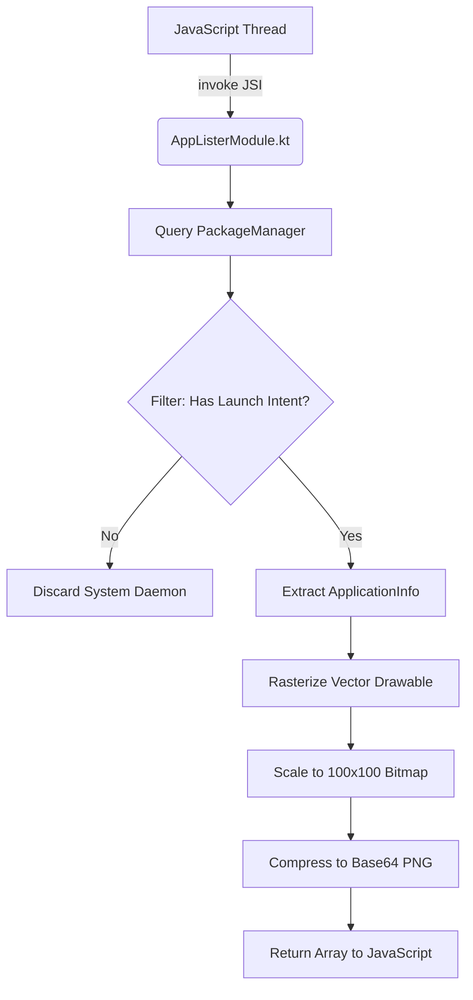

# App Lister Module

React Native and Expo do not provide built-in APIs capable of querying the device's installed application matrix. To support the digital blocklist feature, CommitT leverages a custom Kotlin module to interface directly with the Android `PackageManager`.

## Core Pipeline

The `AppListerModule` exposes a single asynchronous function `getInstalledApps()` to the JavaScript execution environment.

### Smart Filtering
The module avoids returning hundreds of background system services by filtering exclusively via `getLaunchIntentForPackage()`. If an application cannot be manually launched by a user from the home screen launcher, it is systematically excluded from the blocklist options. This guarantees UI cleanliness and operational performance.

### Memory Optimization Protocols
To prevent Out-Of-Memory (OOM) crashes when extracting vectors for upwards of 300 applications, the native layer enforces a strict rasterization standard. All `BitmapDrawable` assets are mathematically scaled down to a 100x100 pixel grid. This ensures each Base64 payload remains under 10KB, securing stability during the React Native bridge transit phase.
