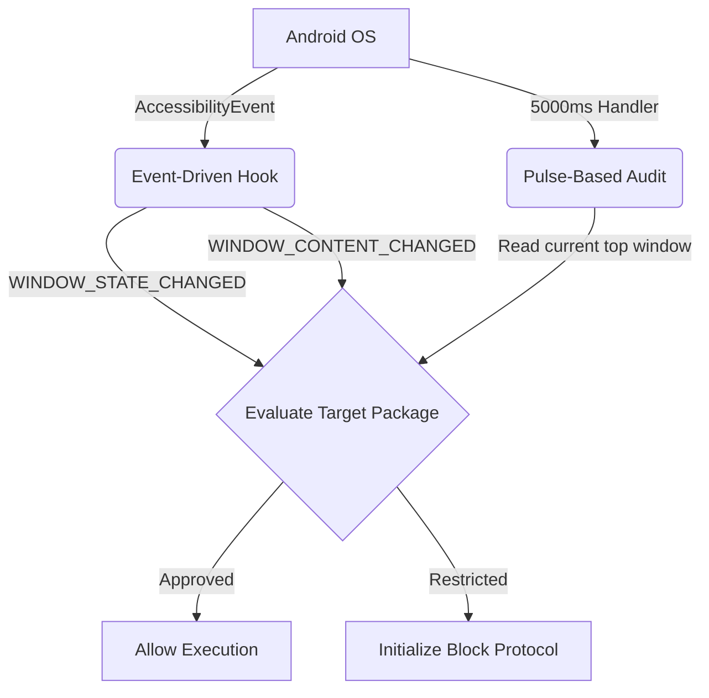
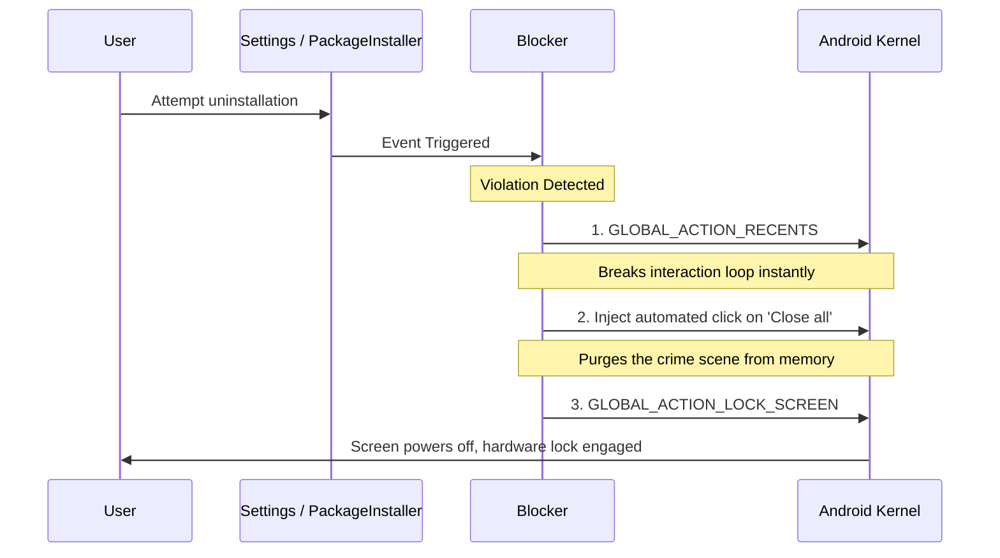

# Blocker Module

The `blocker-module` is the core enforcement infrastructure for the CommitT accountability platform. It utilizes an Android `AccessibilityService` to intercept application launches and user interactions in real-time.

## Dual Enforcement Vectors

The service guarantees absolute enforcement via two complementary monitoring systems to prevent system-level evasion.

1.  **Event-Driven Enforcement**: Responds instantly to `AccessibilityEvent` callbacks to intercept restricted apps the precise millisecond they render.
2.  **Pulse-Based Background Audit**: A continuous 5-second background heartbeat (`pulseRunnable`) periodically re-evaluates the foreground package. This mitigates edge cases where the OS drops accessibility events (e.g., split-screen transitions, Picture-in-Picture mode).

## Location Enforcement (Fail-Closed)

When a commitment includes a geofence, the Blocker maintains a real-time 1Hz GPS tracking stream.

*   **Strict Live Enforcement**: Spatial access decisions are gated exclusively on live coordinates. The service never defaults to cached `getLastKnownLocation()` data, preventing spoofing via background disconnects.
*   **Staleness Threshold**: If a GPS fix is older than 30 seconds (accounting for Android's 20-second background OS polling limitations), the Blocker defaults to a **fail-closed** policy, restricting access until cryptographic location certainty is restored.

## Maximum Escalation (Device Lock & Purge)

If a user attempts a deep security violation (e.g., attempting to uninstall CommitT or disable the accessibility service), the Blocker initiates a **Maximum Escalation** sequence.

On heavily modified OEM variants like Samsung's OneUI, it executes a strict 3-Phase Purge:

## Concurrency and SQLite Stability

Identical to the Scheduler architecture, the Blocker explicitly opens its SQLite database connection in `OPEN_READONLY` mode. This prevents WAL writer contention against the React Native user interface. To eliminate stale reads, the connection is forcefully closed and a fresh WAL snapshot is acquired on every 5-second pulse.
