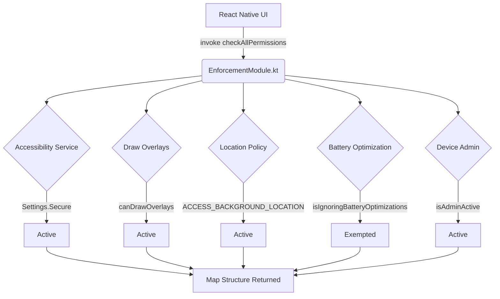

# Enforcement Module

The `enforcement-module` operates as the primary security auditor for the React Native application. It establishes a JSI bridge for inspecting deeply nested OS configurations that standard React Native permission libraries are incapable of accurately evaluating.

## Auditing Protocol

The `checkAllPermissions` function executes a comprehensive state evaluation across critical Android systems:

*   **Accessibility Services**: Validates `Settings.Secure.ENABLED_ACCESSIBILITY_SERVICES` to guarantee the Blocker module is actively armed within the OS layer.
*   **Draw Overlays**: Verifies `canDrawOverlays` privileges, an absolute requirement for rendering the un-dismissable full-screen penalty UI.
*   **Location Constraints**: Validates that GPS permissions are explicitly set to "Allow all the time" (`ACCESS_BACKGROUND_LOCATION`). A standard "Allow while using" configuration is structurally rejected, as Android OS background tracking termination would initiate an inescapable fail-closed blockout sequence.
*   **Battery Optimization**: Confirms the application is whitelisted from Android Doze Mode execution limits.
*   **Device Administration**: Inspects the `DevicePolicyManager` to verify anti-uninstall protections are bound to the package.

## Settings Routing Infrastructure

Because OEMs (Samsung, Xiaomi, OnePlus) continuously alter their Settings menu architectures, standard Android intents frequently fail or misdirect users. The `openSettings` function provides specialized deep-linking to route the user directly to the correct permission configuration page across diverse hardware variants.
