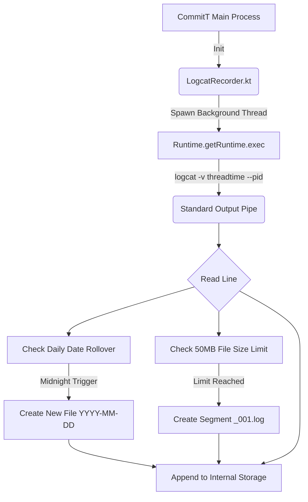

# Logcat Module

The standard Android system logcat buffer is extremely volatile, typically ranging from 64KB to 1MB depending on OEM specifications. Under heavy background execution (such as 1Hz GPS tracking or accessibility service loops), this buffer wraps around in minutes, destroying critical evidence required for debugging distributed system failures.

The `logcat-module` operates as an infinite flight recorder to guarantee state preservation.

## Daemon Architecture

1.  **Daemon Process**: Spawns an isolated background thread that executes a shell `logcat -v threadtime --pid=<APP_PID>` command.
2.  **Stream Pipe**: Continuously reads every line of standard output in real-time without relying on system dumps.
3.  **Persistence**: Appends the stream directly to an internal storage text file matrix (`commit-logcat-YYYY-MM-DD.log`).
4.  **Segmentation**: If a daily log exceeds the 50MB threshold, the module automatically closes the writer and rotates to a new numerical segment to ensure files remain parsable by standard text editors.

## Diagnostic Capabilities

The resulting log files contain a flawless mirror of an external `adb logcat` session, preserving:
*   React Native JavaScript console outputs.
*   `BlockerAccessibilityService` native enforcement triggers and latency metrics.
*   `AlarmScheduler` execution paths and OS-level rejections.
*   System memory thresholds and Garbage Collection events.

These logs securely persist across process terminations and device reboots, serving as the ultimate cryptographic source of truth when debugging Triple-Write database anomalies or strict mode evasions.
