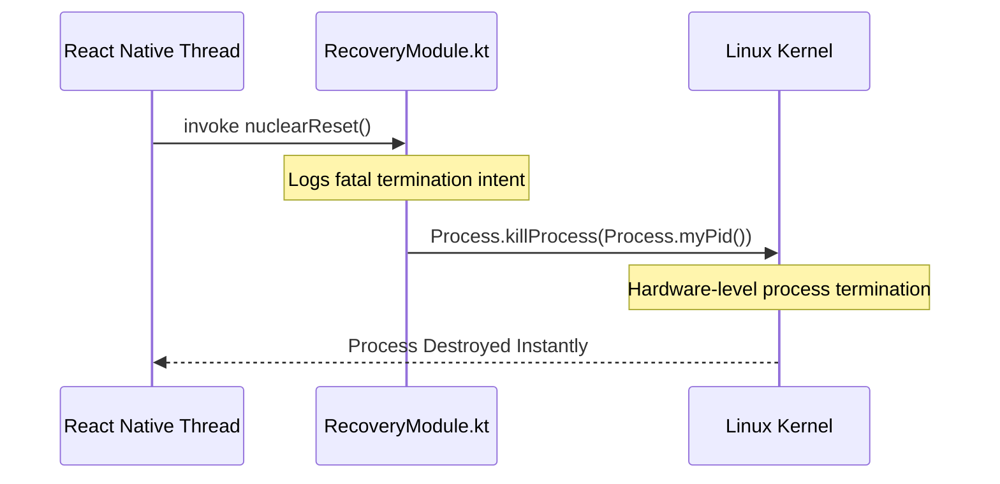

# Recovery & Alarm Modules

These modules encapsulate lightweight, isolated native capabilities that operate strictly outside the boundaries of the React Native architecture.

## Recovery Module

The `RecoveryModule` implements a single operation: `nuclearReset()`.

If the JavaScript thread detects a catastrophic state corruption (e.g., an unrecoverable infinite loop during local database synchronization), it executes this hook to force a hard kernel-level termination.

This ensures Android immediately flushes the application's memory allocation, allowing the operating system to restart the application into a clean, uncorrupted state.

## Alarm Module

The `AlarmModule` functions as an instantaneous native feedback utility. 

While the actual heavy lifting of hardware WakeLocks and alarm firing is administered by the `SchedulerModule`, the `AlarmModule` provides simpler utility hooks:
*   **showToast**: Triggers a native Android Toast message synchronously, bypassing the latency of the React Native rendering bridge.
*   **getLocalTasks**: A diagnostic capability designed to quickly read from the `local_tasks` SQLite table and dump the contents to the screen, verifying database hydration states without executing complex Javascript database queries.
