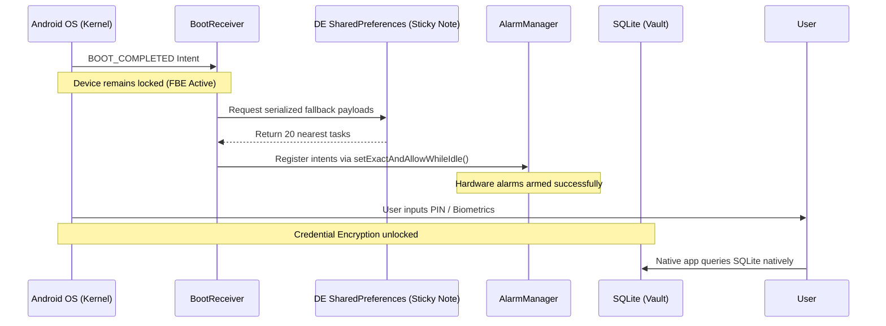
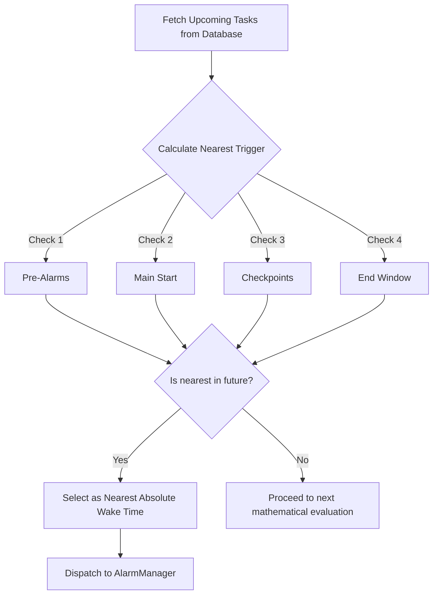

# Scheduler Module

The `scheduler-module` serves as the primary orchestration engine of the CommitT native system. It bypasses the React Native layer entirely to calculate wake windows and explicitly command the Android Kernel's `AlarmManager` to fire hardware-level wakeups.

## Architecture: Vault vs. Sticky Note

To survive unpredicted phone restarts and File-Based Encryption (FBE) lockouts, the Scheduler implements a dual-layered storage architecture.

### 1. The Vault (SQLite)
The primary `commit.db` database. It holds the canonical schedule but is subject to strict Android Credential Encryption (CE). If a user restarts their device, this database remains completely locked and inaccessible at the kernel level until the user enters their PIN.

### 2. The Sticky Note (Device Protected Storage)
To guarantee alarms fire even while the device is locked post-reboot, the Scheduler caches the 20 nearest upcoming alarms into Android's Device Encrypted (DE) `SharedPreferences`. This unencrypted "Sticky Note" allows the `BootReceiver` to successfully schedule the `AlarmManager` before the user unlocks their phone.

## Connection Strategy & Concurrency Mitigations

The native Kotlin SQLite connection historically suffered from fatal Write-Ahead Logging (WAL) contention against the Javascript `expo-sqlite` driver. 

**The Stale-Proof Formula:**
1.  **READONLY Mode**: The `AlarmScheduler` strictly opens the database in `OPEN_READONLY` mode. This prevents it from holding a WAL writer lock. Previously, competing write locks on slow eMMC storage caused `database disk image is malformed` errors and infinite Nuke and Pave loops.
2.  **Fresh Snapshots**: The connection is opened and closed on every invocation of `scheduleNextAlarm`. Caching the connection resulted in "Stale WAL Snapshots," where the Native side became permanently blind to tasks updated by the Javascript thread.

## The Pre-Alarm Math Engine

The `findNextTrigger` algorithm dynamically calculates staggered `PRE_ALARM` offsets, `CHECKPOINT_ALARM` structural pings, and the final `END_ALARM`.

### Hardware Kernel Registration
Once the closest actionable trigger is calculated, the Scheduler routes it directly to the Android `AlarmManager`:
*   **Android 12+ (Exact)**: Utilizes `setAlarmClock` if exact permissions are granted, ensuring millisecond precision.
*   **Degraded Fallback**: Utilizes `setAndAllowWhileIdle` if the user revokes exact scheduling privileges, relying on OS-level batching.
