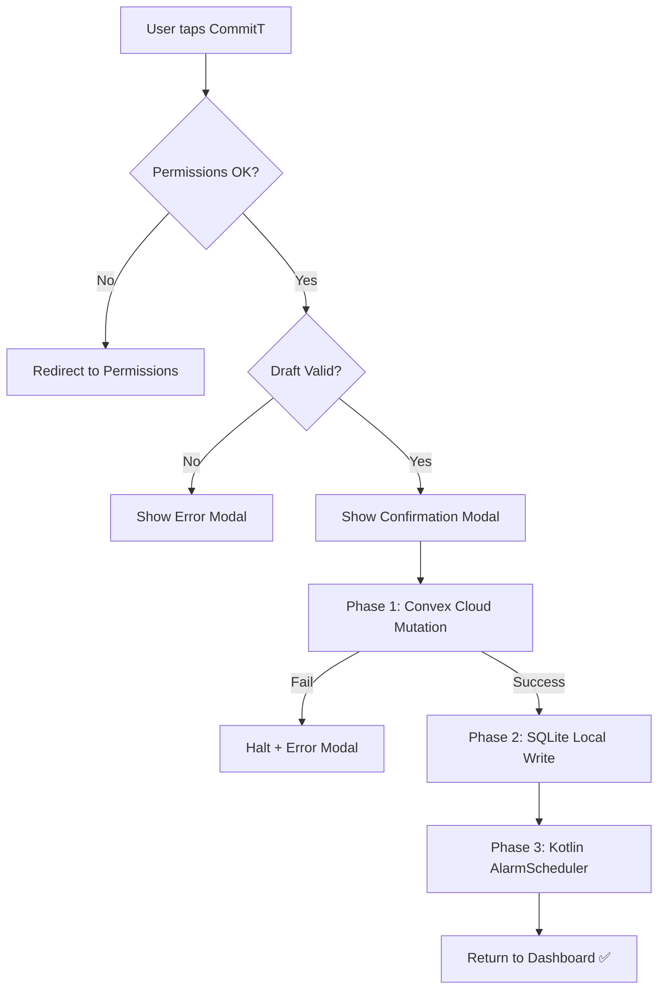

# The Commit Action

When the user taps **"CommitT"** on the FinalScreen, the most critical data path in the application executes: the **Triple-Write Protocol**. This is a three-phase atomic synchronization across cloud, local database, and native hardware.

---

## Pre-Flight Checks

Before the confirmation modal appears, two gates must pass:

### 1. Hardware Permission Gate (Fail-Closed)
All seven system permissions must be granted. If any are missing, the user is **redirected to the permissions audit screen** instead of submitting.

```typescript
const isReady =
  permissions.location &&
  permissions.notifications &&
  permissions.alarms &&
  permissions.overlay &&
  permissions.accessibility &&
  permissions.battery &&
  permissions.admin;

if (!isReady) {
  router.push("/(settings)/permissions");
  return;
}
```

### 2. Draft Validation
The `validateTaskDraft()` function checks for:
- Non-empty commitment title
- At least one time window configured
- Valid penalty/waiver configuration (if set)
- No conflicting conditions

---

## The Triple-Write Protocol



### Phase 1 — Convex Cloud
The remote mutation is attempted first. If the network is unavailable or the server rejects the payload, the **entire operation halts** cleanly with a user-facing error modal. No local state is mutated.

### Phase 2 — Local SQLite
On cloud success, a raw SQL transaction writes the task definition and **all generated future instances** to the on-device database. This powers instant re-renders on the dashboard and calendar tabs without a network round-trip.

### Phase 3 — Kotlin AlarmManager
Finally, `scheduleNextAlarm()` fires across the React Native JSI bridge. The native Kotlin module reads the SQLite state and binds `WakeLock`-backed `PendingIntents` to the hardware alarm clock.

---

## Failure Semantics

Each layer is gated behind the previous. A failure at any stage produces a deterministic rollback path logged via the **Saga pattern**:

| Failure Point | Rollback Action | User Impact |
| :--- | :--- | :--- |
| Cloud mutation fails | No local write occurs | Clean error modal, retry possible |
| SQLite write fails | Cloud document orphaned (self-heals on next sync) | Error modal |
| Alarm registration fails | Task exists but alarms don't fire | Manual resync required |

---

## Example

> **Creating a "Library Focus" commitment:**
> 1. User fills in name, time slots, location preset, blocklist, penalty
> 2. Taps "CommitT"
> 3. ✅ Convex mutation creates the task document in the cloud
> 4. ✅ SQLite inserts the task + 30 future instances locally
> 5. ✅ Kotlin AlarmScheduler binds the next alarm to hardware
> 6. User returns to dashboard — commitment appears immediately
